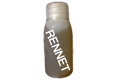
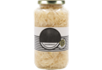

## Aged Barrel - 1

Station: **chemistryStation** - Tool: **none**

- 1 [Oak Barrel](#Oak_Barrel)
- 10 drinkJarGrainAlcohol

## Aged Bourbon - 1

Station: **Brew Station** - Tool: **Charred Barrel**

- 1 [Distilled Bourbon](#Distilled_Bourbon)
- 1 [Charred Barrel](#Charred_Barrel)

## Aged Bulleeet - 1

Station: **Brew Station** - Tool: **Charred Barrel**

- 1 [Distilled Bulleeet](#Distilled_Bulleeet)
- 1 [Charred Barrel](#Charred_Barrel)

## Aged Cheddar - 50

Station: **Fermentor Bench** - Tool: **Aging Shelves**

- 1 [Cheddar Step 5](#Cheddar_Step_5)

## Aged Double IPA  - 1

Station: **Brew Station** - Tool: **Oak Barrel**

- 1 [Double IPA Raw](#Double_IPA_Raw)

## Aged Port Wine - 1

Station: **Brew Station** - Tool: **Aged Barrel**

- 1 [Filtered Merlot](#Filtered_Merlot)

## Aged Scotch - 1

Station: **Brew Station** - Tool: **Aged Barrel**

- 1 [Distilled Scotch](#Distilled_Scotch)
- 1 [Aged Barrel](#Aged_Barrel)
- 5 Air of Scotland

## Aged Wheat Flour - 3

Station: **Fermentor Bench** - Tool: **none**

- 4 [Wheat Flour](#Wheat_Flour)

## Aging Shelves - 1

Station: **workbench** - Tool: **none**

- 10 Walnut Wood Plank
- 7 [Walnut Shelve](#Walnut_Shelve)
- 40 resourceNail

## Alkaline Solution - 1

Station: **Brew Cooker** - Tool: **none**

- 1 bucketRiverWater
- 5 [Wood Ash](#Wood_Ash)
- 1 [Cheese Cloth](#Cheese_Cloth)

## American Fries - 20

Station: **Gas Cooktop** - Tool: **Caste Iron Skillet**

- 1 [American Fries Step 1](#American_Fries_Step_1)
- 10 [Vegetable Oil](#Vegetable_Oil)

## American Fries Step 1 - 1

Station: **Chopping Board** - Tool: **Damascus Knife**

- 10 foodCropPotato

## Apple Cider - 15

Station: **none** - Tool: **none**

- 15 [Apple Juice](#Apple_Juice)
- 5 resourceCropHopsFlower
- 5 [Ground Cinnamon](#Ground_Cinnamon)

## Apple Juice - 1

Station: **KitchNaid** - Tool: **Veggie Attachment**

- 5 Apple
- 1 drinkJarEmpty

## Apple Pie - 1

Station: **Gas Oven** - Tool: **PyreX Bakeware**

- 6 [Sliced Apples](#Sliced_Apples)
- 2 [Wheat Flour](#Wheat_Flour)
- 1 foodEgg
- 1 resourceAnimalFat
- 1 drinkJarBoiledWater

## Apple Woodchips - 2

Station: **tablesaw** - Tool: **none**

- 1 Apple Wood Plank

## Apples and Cream - 1

Station: **Gas Cooktop** - Tool: **Caste Iron Skillet**

- 2 [Sliced Apples](#Sliced_Apples)
- 1 [Ground Cinnamon](#Ground_Cinnamon)

## Avocado Spinach Salad - 1

Station: **Chopping Board** - Tool: **none**

- 3 [Sliced Avocado](#Sliced_Avocado)
- 3 Spinach
- 1 [Chopped Walnuts](#Chopped_Walnuts)
- 1 [Olive Oil](#Olive_Oil)
- 1 [Salt and Pepper](#Salt_and_Pepper)

## BBQ Elk Jerky - 10

Station: **Cold Smoker** - Tool: **Smoker Mat**

- 1 [Marinated BBQ Elk](#Marinated_BBQ_Elk)
- 5 [Walnut Woodchips](#Walnut_Woodchips)

## BBQ Pork Ribs - 10

Station: **Wood Grill** - Tool: **Tongs**

- 1 Pork Ribs
- 10 [Spicy BBQ Sauce](#Spicy_BBQ_Sauce)
- 2 [Apple Woodchips](#Apple_Woodchips)
- 2 [Walnut Woodchips](#Walnut_Woodchips)
- 1 Mesquite Woodchips

## Baked Rigatoni - 1

Station: **Gas Oven** - Tool: **PyreX Bakeware**

- 1 [Baked Rigatoni Step 2](#Baked_Rigatoni_Step_2)
- 1 [Parmesan](#Parmesan)

## Baked Rigatoni Step 1 - 1

Station: **Gas Cooktop** - Tool: **Caste Iron Skillet**

- 5 [Ground Veal](#Ground_Veal)
- 1 [Olive Oil](#Olive_Oil)
- 1 [Salt and Pepper](#Salt_and_Pepper)

## Baked Rigatoni Step 2 - 1

Station: **KitchNaid** - Tool: **Mixing Bowl**

- 1 [Baked Rigatoni Step 1](#Baked_Rigatoni_Step_1)
- 2 [Marinara](#Marinara)
- 2 [Parmesan](#Parmesan)

## Baking Sheet - 1

Station: **forge** - Tool: **toolAnvil**

- 100 unit_iron
- 10 unit_clay

## Bananna Bread - 10

Station: **Gas Oven** - Tool: **PyreX Bakeware**

- 1 [Bananna Bread Step 2](#Bananna_Bread_Step_2)

## Bananna Bread Step 1 - 1

Station: **KitchNaid** - Tool: **Mixing Bowl**

- 10 [Raw Sugar](#Raw_Sugar)
- 5 [Butter](#Butter)
- 10 Banana
- 2 foodEgg
- 2 [Aged Wheat Flour](#Aged_Wheat_Flour)

## Bananna Bread Step 2 - 1

Station: **KitchNaid** - Tool: **Mixing Bowl**

- 1 [Bananna Bread Step 1](#Bananna_Bread_Step_1)
- 1 [Salt](#Salt)
- 1 [Milk](#Milk)
- 1 [Ground Cinnamon](#Ground_Cinnamon)

## Barley Malt - 50

Station: **Brew Cooker** - Tool: **Drying Pan**

- 50 [Spouted Barley](#Spouted_Barley)

## Barrel Roaster - 1

Station: **workbench** - Tool: **none**

- 20 resourceForgedIron
- 100 resourceScrapIron

## Bechamel - 1

Station: **Gas Cooktop** - Tool: **toolCookingPot**

- 1 [Wheat Flour](#Wheat_Flour)
- 2 [Milk](#Milk)
- 1 [Salt](#Salt)

## Beef Chili - 20

Station: **Wood Grill** - Tool: **Ceramic Dutch Oven**

- 1 [Beef Chili Step 3](#Beef_Chili_Step_3)
- 2 [Sliced Green Bell](#Sliced_Green_Bell)
- 2 [Sliced Yellow Bell](#Sliced_Yellow_Bell)
- 2 [Sliced Red Bell](#Sliced_Red_Bell)
- 20 [Cheddar](#Cheddar)

## Beef Chili Step 1 - 1

Station: **Wood Grill** - Tool: **Ceramic Dutch Oven**

- 10 [Ground Beef](#Ground_Beef)
- 5 [Sliced Steak](#Sliced_Steak)
- 5 [Crushed Tomato](#Crushed_Tomato)
- 2 [Beer Double IPA](#Beer_Double_IPA)
- 5 [Salt and Pepper](#Salt_and_Pepper)

## Beef Chili Step 2 - 1

Station: **Wood Grill** - Tool: **Ceramic Dutch Oven**

- 1 [Beef Chili Step 1](#Beef_Chili_Step_1)
- 10 [Diced Onions](#Diced_Onions)
- 5 [Ground Hot Pepper](#Ground_Hot_Pepper)
- 5 [Ground Cumin](#Ground_Cumin)
- 5 [Ground Ancho ](#Ground_Ancho_)

## Beef Chili Step 3 - 1

Station: **none** - Tool: **none**

- 1 [Beef Chili Step 2](#Beef_Chili_Step_2)
- 1 [Cooked Pinto Bean](#Cooked_Pinto_Bean)
- 1 [Cooked Black Bean](#Cooked_Black_Bean)
- 1 [Cooked Kidney Bean](#Cooked_Kidney_Bean)

## Beef Taco - 5

Station: **Gas Cooktop** - Tool: **Caste Iron Skillet**

- 1 [Ground Beef](#Ground_Beef)
- 5 [Shredded Lettuce ](#Shredded_Lettuce_)
- 5 [Diced Tomatos](#Diced_Tomatos)
- 5 [Shredded Cheddar](#Shredded_Cheddar)

## Beer Cheap - 15

Station: **Brew Station** - Tool: **Bottle Capper**

- 1 [Beer Cheap Raw](#Beer_Cheap_Raw)

## Beer Cheap Mash - 1

Station: **Brew Cooker** - Tool: **Masher**

- 25 [Light Malt](#Light_Malt)
- 15 drinkJarBoiledWater

## Beer Cheap Raw - 1

Station: **Brew Station** - Tool: **Carboy**

- 1 [Beer Cheap Wort](#Beer_Cheap_Wort)

## Beer Cheap Wort - 1

Station: **Brew Cooker** - Tool: **Boiler**

- 1 [Beer Cheap Mash](#Beer_Cheap_Mash)

## Beer Double IPA - 15

Station: **Brew Station** - Tool: **Bottle Capper**

- 1 [Aged Double IPA ](#Aged_Double_IPA_)
- 5 Bottle Cap

## Beer IPA - 15

Station: **Brew Station** - Tool: **Bottle Capper**

- 1 [Beer IPA Raw](#Beer_IPA_Raw)

## Beer IPA Mash - 1

Station: **Brew Cooker** - Tool: **Masher**

- 25 [Golden Malt](#Golden_Malt)
- 15 drinkJarBoiledWater

## Beer IPA Raw - 1

Station: **Brew Station** - Tool: **Carboy**

- 1 [Beer IPA Wort](#Beer_IPA_Wort)

## Beer IPA Wort - 1

Station: **Brew Cooker** - Tool: **Boiler**

- 1 [Beer IPA Mash](#Beer_IPA_Mash)
- 15 Bitter Hops
- 5 resourceCropHopsFlower
- 15 Floral Hops

## Beer Lager - 15

Station: **Brew Station** - Tool: **Bottle Capper**

- 1 [Beer Lager Raw](#Beer_Lager_Raw)

## Beer Lager Mash - 1

Station: **Brew Cooker** - Tool: **Masher**

- 25 [Light Malt](#Light_Malt)
- 15 drinkJarBoiledWater

## Beer Lager Raw - 1

Station: **Brew Station** - Tool: **Carboy**

- 1 [Beer Lager Wort](#Beer_Lager_Wort)

## Beer Lager Wort - 1

Station: **Brew Cooker** - Tool: **Boiler**

- 1 [Beer Lager Mash](#Beer_Lager_Mash)
- 15 resourceCropHopsFlower
- 5 Floral Hops

## Beer Stout - 15

Station: **Brew Station** - Tool: **Bottle Capper**

- 1 [Beer Stout Raw](#Beer_Stout_Raw)

## Beer Stout Mash - 1

Station: **Brew Cooker** - Tool: **Masher**

- 25 [Dark Malt](#Dark_Malt)
- 15 drinkJarBoiledWater

## Beer Stout Raw - 1

Station: **Brew Station** - Tool: **Carboy**

- 1 [Beer Stout Wort](#Beer_Stout_Wort)

## Beer Stout Wort - 1

Station: **Brew Cooker** - Tool: **Boiler**

- 1 [Beer Stout Mash](#Beer_Stout_Mash)
- 10 resourceCropHopsFlower
- 10 Floral Hops

## Beet Juice - 1

Station: **KitchNaid** - Tool: **Veggie Attachment**

- 5 Beet
- 1 Cucumber
- 1 Carrot

## Beet Salad - 1

Station: **Chopping Board** - Tool: **Damascus Knife**

- 1 [Beet Salad Step 1](#Beet_Salad_Step_1)
- 1 [Cooking Vinegar](#Cooking_Vinegar)
- 1 [Minced Garlic](#Minced_Garlic)
- 1 [Mixed Herbs](#Mixed_Herbs)
- 1 [Salt and Pepper](#Salt_and_Pepper)

## Beet Salad Step 1 - 1

Station: **Gas Cooktop** - Tool: **toolCookingPot**

- 5 [Sliced Beets](#Sliced_Beets)
- 2 Corn Husk
- 2 [Diced Onions](#Diced_Onions)

## Biscuit - 10

Station: **Gas Oven** - Tool: **Baking Sheet**

- 1 [Biscuit Step 3](#Biscuit_Step_3)

## Biscuit Step 1 - 1

Station: **KitchNaid** - Tool: **Mixing Bowl**

- 2 [Aged Wheat Flour](#Aged_Wheat_Flour)
- 1 [Salt](#Salt)
- 5 [Lard](#Lard)

## Biscuit Step 2 - 1

Station: **KitchNaid** - Tool: **Mixing Bowl**

- 1 [Biscuit Step 1](#Biscuit_Step_1)
- 1 [Milk](#Milk)

## Biscuit Step 3 - 1

Station: **Chopping Board** - Tool: **Pizza Cutter**

- 1 [Biscuit Step 2](#Biscuit_Step_2)

## Biscuits and Gravy - 1

Station: **none** - Tool: **none**

- 2 [Biscuit](#Biscuit)
- 4 [Sausage Gravy](#Sausage_Gravy)

## Black Pepper - 1

Station: **KitchNaid** - Tool: **Grain Miller**

- 1 Black Pepper Corn

## Black Pepper - 10

Station: **none** - Tool: **none**

- 1 Black Pepper Tin

## Blueberry Ice Cream - 10

Station: **KitchNaid** - Tool: **Ice Cream Bowl**

- 10 [Milk](#Milk)
- 10 foodCropBlueberries
- 5 [Raw Sugar](#Raw_Sugar)
- 1 [Salt](#Salt)

## Boiled Egg Noodles - 1

Station: **Gas Cooktop** - Tool: **toolCookingPot**

- 1 [Egg Noodles](#Egg_Noodles)
- 2 drinkJarBoiledWater
- 1 [Salt](#Salt)

## Boiled Linguini - 1

Station: **Gas Cooktop** - Tool: **toolCookingPot**

- 1 [Linguini](#Linguini)
- 2 drinkJarBoiledWater
- 1 [Salt](#Salt)

## Boiled Penne - 1

Station: **Gas Cooktop** - Tool: **toolCookingPot**

- 1 [Penne](#Penne)
- 2 drinkJarBoiledWater
- 1 [Salt](#Salt)

## Boiled Rigatoni - 1

Station: **none** - Tool: **none**

- 1 [Rigatoni](#Rigatoni)
- 2 drinkJarBoiledWater
- 1 [Salt](#Salt)

## Boiled Spaghetti - 1

Station: **Gas Cooktop** - Tool: **toolCookingPot**

- 1 [Spaghetti](#Spaghetti)
- 2 drinkJarBoiledWater
- 1 [Salt](#Salt)

## Boiler - 1

Station: **forge** - Tool: **toolAnvil**

- 1000 unit_iron
- 100 unit_clay

## Bolognese Dish - 1

Station: **Gas Cooktop** - Tool: **toolCookingPot**

- 1 [Bolognese Sauce](#Bolognese_Sauce)
- 1 [Boiled Penne](#Boiled_Penne)
- 1 [Parmesan](#Parmesan)
- 1 [Butter](#Butter)

## Bolognese Sauce - 1

Station: **Gas Cooktop** - Tool: **toolCookingPot**

- 1 [Bolognese Sauce Step 3](#Bolognese_Sauce_Step_3)
- 1 [White Zin](#White_Zin)
- 1 [Crushed Tomato](#Crushed_Tomato)

## Bolognese Sauce Step 1 - 1

Station: **Gas Cooktop** - Tool: **toolCookingPot**

- 1 [Olive Oil](#Olive_Oil)
- 1 [Butter](#Butter)
- 10 [Diced Onions](#Diced_Onions)
- 1 Celery
- 1 Carrot

## Bolognese Sauce Step 2 - 1

Station: **Gas Cooktop** - Tool: **toolCookingPot**

- 1 [Bolognese Sauce Step 1](#Bolognese_Sauce_Step_1)
- 5 [Ground Veal](#Ground_Veal)
- 1 [Salt and Pepper](#Salt_and_Pepper)
- 2 [Ground Oregano](#Ground_Oregano)

## Bolognese Sauce Step 3 - 1

Station: **Gas Cooktop** - Tool: **toolCookingPot**

- 1 [Bolognese Sauce Step 2](#Bolognese_Sauce_Step_2)
- 1 [Milk](#Milk)

## Bottle Capper - 1

Station: **workbench** - Tool: **none**

- 20 resourceForgedIron
- 10 resourceMechanicalParts

## Bourbon - 15

Station: **Brew Station** - Tool: **Mixing Cask**

- 1 [Aged Bourbon](#Aged_Bourbon)
- 5 drinkJarBoiledWater

## Bourbon Mash - 1

Station: **Brew Cooker** - Tool: **Masher**

- 21 foodCropCorn
- 14 [Rye Malt](#Rye_Malt)
- 5 [Barley Malt](#Barley_Malt)

## Bowl of Rice - 1

Station: **Gas Cooktop** - Tool: **toolCookingPot**

- 2 Rice
- 2 drinkCanRiverWater

## Brazilian Grilled Pineapple - 10

Station: **Cold Smoker** - Tool: **Turkey Rack**

- 5 Pineapple
- 5 [Raw Sugar](#Raw_Sugar)
- 2 [Ground Cinnamon](#Ground_Cinnamon)

## Bread Dough - 1

Station: **KitchNaid** - Tool: **Dough Hook**

- 5 [Wheat Flour](#Wheat_Flour)
- 2 foodEgg
- 1 drinkJarBoiledWater
- 1 [Salt](#Salt)

## Breadcrumbs - 20

Station: **KitchNaid** - Tool: **Food Processor**

- 1 [Breadcrumbs Step 1](#Breadcrumbs_Step_1)

## Breadcrumbs Step 1 - 1

Station: **Gas Oven** - Tool: **Baking Sheet**

- 10 [Sliced Bread](#Sliced_Bread)

## Brew Cooker - 1

Station: **workbench** - Tool: **none**

- 20 resourceForgedIron
- 10 resourceMechanicalParts
- 10 resourceScrapPolymers

## Brew Station - 1

Station: **workbench** - Tool: **none**

- 20 resourceForgedIron
- 10 resourceMechanicalParts
- 10 resourceScrapPolymers

## Brick Planter - 1

Station: **workbench** - Tool: **none**

- 100 resourceClayLump

## Brick Planter 2 - 1

Station: **workbench** - Tool: **none**

- 100 resourceClayLump

## Brick Planter 3 - 1

Station: **workbench** - Tool: **none**

- 100 resourceClayLump

## Brick Planter 4 - 1

Station: **workbench** - Tool: **none**

- 100 resourceClayLump

## Brined Coffee Elk - 1

Station: **KitchNaid** - Tool: **Mixing Bowl**

- 10 Elk Scraps
- 5 [Salt and Pepper](#Salt_and_Pepper)
- 5 resourceCropCoffeeBeans
- 1 [Cooking Vinegar](#Cooking_Vinegar)
- 1 drinkJarCoffee

## Brined Spicy Elk - 1

Station: **KitchNaid** - Tool: **Mixing Bowl**

- 10 Elk Scraps
- 5 [Salt and Pepper](#Salt_and_Pepper)
- 20 [Ground Hot Pepper](#Ground_Hot_Pepper)
- 1 [Cooking Vinegar](#Cooking_Vinegar)
- 1 drinkJarBoiledWater

## Briney Water - 1

Station: **none** - Tool: **none**

- 5 [Salt](#Salt)
- 15 drinkJarBoiledWater

## Bulleeet Mash - 1

Station: **Brew Cooker** - Tool: **Masher**

- 39 Rye
- 1 [Barley Malt](#Barley_Malt)

## Bulleeet Rye - 15

Station: **Brew Station** - Tool: **Mixing Cask**

- 1 [Aged Bulleeet](#Aged_Bulleeet)
- 5 drinkJarBoiledWater

## Burger Basket - 1

Station: **Chopping Board** - Tool: **none**

- 1 [Hamburger](#Hamburger)
- 2 [American Fries](#American_Fries)
- 3 [Ketchup](#Ketchup)

## Butter - 10

Station: **KitchNaid** - Tool: **Dough Hook**

- 1 Raw Milk
- 1 [Salt](#Salt)

## Buttery Delmontico - 1

Station: **Wood Grill** - Tool: **Tongs**

- 1 Delmontico
- 2 [Butter](#Butter)
- 5 [Apple Woodchips](#Apple_Woodchips)
- 2 [Salt and Pepper](#Salt_and_Pepper)

## Cabernet Sauvignon - 15

Station: **Brew Station** - Tool: **Floor Corker**

- 1 [Filtered Cabernet](#Filtered_Cabernet)

## Canned Olives - 1

Station: **Gas Cooktop** - Tool: **toolCookingPot**

- 10 Olive
- 1 drinkCanEmpty
- 1 drinkJarBoiledWater

## Carboy - 1

Station: **forge** - Tool: **toolAndDieSet**

- 500 unit_glass
- 100 unit_clay

## Caste Iron Skillet - 1

Station: **forge** - Tool: **toolForgeCrucible**

- 100 unit_iron
- 10 unit_clay

## Cattle Feed - 1

Station: **none** - Tool: **none**

- 2 Sorghum
- 2 Wheat
- 2 hayBaleBlock
- 2 bucketRiverWater

## Ceramic Dutch Oven - 1

Station: **forge** - Tool: **toolAndDieSet**

- 1000 unit_glass
- 100 unit_clay

## Chardonne - 15

Station: **Brew Station** - Tool: **Floor Corker**

- 1 [Filtered Chardonne](#Filtered_Chardonne)

## Charred Barrel - 1

Station: **Brew Cooker** - Tool: **Barrel Roaster**

- 1 [Oak Barrel](#Oak_Barrel)

## Cheddar - 50

Station: **Chopping Board** - Tool: **Zhang Cleaver**

- 1 [Cheddar Step 5](#Cheddar_Step_5)

## Cheddar Step 1 - 1

Station: **Brew Cooker** - Tool: **Boiler**

- 5 Raw Milk
- 10 [Milk](#Milk)
- 5 [Salt](#Salt)
- 5 [Cheese Culture](#Cheese_Culture)
- 5 [Rennet](#Rennet)

## Cheddar Step 2 - 1

Station: **Brew Cooker** - Tool: **Boiler**

- 1 [Cheddar Step 1](#Cheddar_Step_1)

## Cheddar Step 3 - 1

Station: **Chopping Board** - Tool: **Zhang Cleaver**

- 1 [Cheddar Step 2](#Cheddar_Step_2)

## Cheddar Step 4 - 1

Station: **Fermentor Bench** - Tool: **Cheese Press**

- 1 [Cheddar Step 3](#Cheddar_Step_3)
- 5 [Salt](#Salt)
- 1 [Cheese Cloth](#Cheese_Cloth)

## Cheddar Step 5 - 1

Station: **Fermentor Bench** - Tool: **none**

- 1 [Cheddar Step 4](#Cheddar_Step_4)
- 1 [Briney Water](#Briney_Water)

## Cheese Cloth - 1

Station: **workbench** - Tool: **none**

- 5 resourceCropCottonPlant

## Cheese Culture - 1

Station: **Fermentor Bench** - Tool: **none**

- 5 Raw Milk
- 15 drinkJarEmpty

## Cheese Pizza - 1

Station: **Gas Oven** - Tool: **Pizza Stone**

- 1 [Bread Dough](#Bread_Dough)
- 3 [Cheddar](#Cheddar)
- 3 [Parmesan](#Parmesan)
- 1 [Olive Oil](#Olive_Oil)

## Cheese Press - 1

Station: **workbench** - Tool: **none**

- 20 resourceForgedSteel
- 20 resourceMechanicalParts

## Cheeseburger - 1

Station: **Wood Grill** - Tool: **Spatula**

- 1 [Hamburger Patty](#Hamburger_Patty)
- 1 [Hamburger Fixings](#Hamburger_Fixings)
- 1 [Cheddar](#Cheddar)

## Cherry Ice Cream - 1

Station: **KitchNaid** - Tool: **Ice Cream Bowl**

- 10 [Milk](#Milk)
- 10 Cherry
- 5 [Raw Sugar](#Raw_Sugar)
- 1 [Salt](#Salt)

## Cherry Pie - 1

Station: **Gas Oven** - Tool: **PyreX Bakeware**

- 4 Cherry
- 2 [Wheat Flour](#Wheat_Flour)
- 1 foodEgg
- 1 resourceAnimalFat
- 1 drinkJarBoiledWater

## Cherry Woodchips - 2

Station: **tablesaw** - Tool: **none**

- 1 Cherry Wood Plank

## Chicken Feed - 1

Station: **none** - Tool: **none**

- 4 foodCropCorn
- 1 Wheat
- 1 Sorghum
- 2 bucketRiverWater

## Chicken Stock - 5

Station: **Gas Cooktop** - Tool: **toolCookingPot**

- 1 Whole Chicken
- 15 drinkJarBoiledWater

## Chicken Tamale - 20

Station: **Gas Cooktop** - Tool: **toolCookingPot**

- 1 [Chicken Tamale Step 5](#Chicken_Tamale_Step_5)
- 20 [Dried Husk](#Dried_Husk)

## Chicken Tamale Step 1 - 1

Station: **Gas Cooktop** - Tool: **Caste Iron Skillet**

- 5 [Diced Onions](#Diced_Onions)
- 2 [Minced Garlic](#Minced_Garlic)
- 1 [Salt](#Salt)
- 5 drinkJarBoiledWater
- 5 [Pulled Chicken](#Pulled_Chicken)

## Chicken Tamale Step 2 - 1

Station: **KitchNaid** - Tool: **Food Processor**

- 5 Tomatillo
- 2 Jalapeno Pepper
- 5 Cilantro
- 1 [Minced Garlic](#Minced_Garlic)

## Chicken Tamale Step 3 - 1

Station: **Gas Cooktop** - Tool: **Caste Iron Skillet**

- 1 [Olive Oil](#Olive_Oil)
- 3 [Diced Onions](#Diced_Onions)
- 1 [Chicken Tamale Step 2](#Chicken_Tamale_Step_2)
- 1 [Salt and Pepper](#Salt_and_Pepper)

## Chicken Tamale Step 4 - 1

Station: **Gas Cooktop** - Tool: **Caste Iron Skillet**

- 1 [Chicken Tamale Step 3](#Chicken_Tamale_Step_3)
- 1 [Chicken Tamale Step 1](#Chicken_Tamale_Step_1)

## Chicken Tamale Step 5 - 1

Station: **KitchNaid** - Tool: **Mixing Bowl**

- 2 [Corn Masa](#Corn_Masa)
- 2 [Chicken Stock](#Chicken_Stock)
- 10 [Lard](#Lard)
- 1 [Salt](#Salt)

## Chile Relleno - 1

Station: **Gas Cooktop** - Tool: **Caste Iron Skillet**

- 1 [Chile Relleno Step 2](#Chile_Relleno_Step_2)
- 1 [Chile Relleno Step 3](#Chile_Relleno_Step_3)
- 2 [Lard](#Lard)

## Chile Relleno Step 1 - 1

Station: **Gas Oven** - Tool: **Baking Sheet**

- 2 Pablano Pepper

## Chile Relleno Step 2 - 1

Station: **Chopping Board** - Tool: **Damascus Knife**

- 1 [Chile Relleno Step 1](#Chile_Relleno_Step_1)
- 6 [Queso Fresco](#Queso_Fresco)

## Chile Relleno Step 3 - 1

Station: **KitchNaid** - Tool: **Mixing Bowl**

- 2 foodEgg
- 1 [Aged Wheat Flour](#Aged_Wheat_Flour)

## Chilled Cucumber Step 1 - 1

Station: **KitchNaid** - Tool: **Food Processor**

- 5 [Grated Cucumber](#Grated_Cucumber)
- 1 Meyer Lemon
- 5 [Diced Mint](#Diced_Mint)
- 5 [Diced Dill](#Diced_Dill)
- 1 [Minced Garlic](#Minced_Garlic)

## Chilled Cucumber Yogurt Soup - 1

Station: **KitchNaid** - Tool: **Mixing Bowl**

- 1 [Chilled Cucumber Step 1](#Chilled_Cucumber_Step_1)
- 4 [Plain Yogurt](#Plain_Yogurt)
- 2 [Olive Oil](#Olive_Oil)
- 1 [Salt](#Salt)

## Chips and Salsa - 1

Station: **Chopping Board** - Tool: **none**

- 3 [Tortillas Chips](#Tortillas_Chips)
- 2 [Spicy Salsa](#Spicy_Salsa)

## Chopped Romaine - 5

Station: **Chopping Board** - Tool: **Damascus Knife**

- 3 Romaine

## Chopped Walnuts - 5

Station: **KitchNaid** - Tool: **Food Processor**

- 3 Walnut

## Chopping Board - 1

Station: **tablesaw** - Tool: **none**

- 10 Walnut Wood Plank

## Clay Pot - 1

Station: **forge** - Tool: **toolForgeCrucible**

- 1000 unit_clay

## Coconut Ice Cream - 1

Station: **KitchNaid** - Tool: **Ice Cream Bowl**

- 10 [Milk](#Milk)
- 10 Coconut
- 5 [Raw Sugar](#Raw_Sugar)
- 1 [Salt](#Salt)

## Coffee Elk Jerky - 10

Station: **Cold Smoker** - Tool: **Smoker Mat**

- 1 [Brined Coffee Elk](#Brined_Coffee_Elk)
- 5 [Maple Woodchips](#Maple_Woodchips)

## Cold Smoker - 1

Station: **workbench** - Tool: **none**

- 20 resourceForgedIron
- 10 resourceMechanicalParts
- 10 resourceScrapPolymers

## Cooked Bacon - 1

Station: **Gas Cooktop** - Tool: **Caste Iron Skillet**

- 1 [Smoked Bacon](#Smoked_Bacon)

## Cooked Black Bean - 5

Station: **Gas Cooktop** - Tool: **toolCookingPot**

- 5 Black Bean
- 5 drinkJarBoiledWater

## Cooked Ham - 1

Station: **Gas Oven** - Tool: **PyreX Bakeware**

- 1 [Smoked Ham](#Smoked_Ham)

## Cooked Ham - 1

Station: **Gas Oven** - Tool: **PyreX Bakeware**

- 1 [Cured Ham](#Cured_Ham)

## Cooked Kidney Bean - 1

Station: **Gas Cooktop** - Tool: **toolCookingPot**

- 5 Kidney Bean
- 5 drinkJarBoiledWater

## Cooked Pinto Bean - 5

Station: **Gas Cooktop** - Tool: **toolCookingPot**

- 5 Pinto Bean
- 5 drinkJarBoiledWater

## Cooking Vinegar - 10

Station: **none** - Tool: **none**

- 1 [Apple Cider](#Apple_Cider)

## Corn Masa - 10

Station: **KitchNaid** - Tool: **Grain Miller**

- 1 [Corn Masa Step 2](#Corn_Masa_Step_2)

## Corn Masa Step 1 - 1

Station: **Brew Cooker** - Tool: **Boiler**

- 10 foodCropCorn
- 1 [Alkaline Solution](#Alkaline_Solution)

## Corn Masa Step 2 - 1

Station: **Brew Cooker** - Tool: **Drying Pan**

- 1 [Corn Masa Step 1](#Corn_Masa_Step_1)

## Corn Tortillas - 10

Station: **Gas Cooktop** - Tool: **Caste Iron Skillet**

- 1 [Corn Tortillas Step 2](#Corn_Tortillas_Step_2)

## Corn Tortillas Step 1 - 1

Station: **KitchNaid** - Tool: **Mixing Bowl**

- 5 [Corn Masa](#Corn_Masa)
- 1 [Salt](#Salt)
- 4 drinkJarBoiledWater

## Corn Tortillas Step 2 - 1

Station: **KitchNaid** - Tool: **Pasta Helper**

- 1 [Corn Tortillas Step 1](#Corn_Tortillas_Step_1)

## Country Boy Breakfast - 1

Station: **Chopping Board** - Tool: **none**

- 2 [Fried Eggs](#Fried_Eggs)
- 1 [Hashbrowns](#Hashbrowns)
- 1 [Grits](#Grits)
- 2 [Fried Ham Steak](#Fried_Ham_Steak)
- 1 [Biscuits and Gravy](#Biscuits_and_Gravy)

## Crunchy Celery - 1

Station: **none** - Tool: **none**

- 1 Celery
- 1 [Cooking Vinegar](#Cooking_Vinegar)

## Crushed Tomato - 1

Station: **KitchNaid** - Tool: **Veggie Attachment**

- 5 Tomato

## Cured Ham - 1

Station: **Cold Smoker** - Tool: **Meat Hanger**

- 1 Ham
- 10 [Salt](#Salt)
- 1 [Salt and Pepper](#Salt_and_Pepper)

## Cured Pancetta - 1

Station: **none** - Tool: **none**

- 1 Pork Belly
- 5 [Salt](#Salt)
- 10 [Black Pepper](#Black_Pepper)

## Cut Green Beans - 5

Station: **none** - Tool: **none**

- 3 Green Bean

## Damascus Blade - 1

Station: **forge** - Tool: **toolAnvil**

- 1000 unit_iron
- 100 unit_clay

## Damascus Handle - 1

Station: **workbench** - Tool: **none**

- 5 Cherry Wood Plank

## Damascus Knife - 1

Station: **workbench** - Tool: **none**

- 1 [Damascus Handle](#Damascus_Handle)
- 1 [Damascus Blade](#Damascus_Blade)

## Dark Malt - 50

Station: **Brew Cooker** - Tool: **Drying Pan**

- 50 [Spouted Sorghum](#Spouted_Sorghum)

## Denver Omelette - 1

Station: **Gas Cooktop** - Tool: **Caste Iron Skillet**

- 1 [Omelette Batter](#Omelette_Batter)
- 1 [Denver Omelette Step 1](#Denver_Omelette_Step_1)

## Denver Omelette Step 1 - 1

Station: **Chopping Board** - Tool: **none**

- 3 [Diced Onions](#Diced_Onions)
- 3 [Diced Ham](#Diced_Ham)
- 3 [Diced Green Peppers](#Diced_Green_Peppers)
- 3 [Sliced Mushrooms](#Sliced_Mushrooms)
- 3 [Cheddar](#Cheddar)

## Diced Carrot - 5

Station: **Chopping Board** - Tool: **Damascus Knife**

- 3 Carrot

## Diced Celery - 3

Station: **Chopping Board** - Tool: **Damascus Knife**

- 5 Celery

## Diced Cilantro - 5

Station: **KitchNaid** - Tool: **Food Processor**

- 3 Cilantro

## Diced Dill - 5

Station: **KitchNaid** - Tool: **Food Processor**

- 3 Dill

## Diced Green Peppers - 5

Station: **Chopping Board** - Tool: **Damascus Knife**

- 3 Green Bell

## Diced Ham - 5

Station: **Chopping Board** - Tool: **Damascus Knife**

- 3 [Ham Steak](#Ham_Steak)

## Diced Mint - 5

Station: **Chopping Board** - Tool: **Damascus Knife**

- 3 Mint

## Diced Mint - 5

Station: **KitchNaid** - Tool: **Food Processor**

- 3 Mint

## Diced Onions - 5

Station: **Chopping Board** - Tool: **Damascus Knife**

- 3 Onion

## Diced Tomatos - 5

Station: **Chopping Board** - Tool: **Damascus Knife**

- 3 Tomato

## Distilled Bourbon - 1

Station: **Brew Cooker** - Tool: **Still**

- 1 [Raw Bourbon](#Raw_Bourbon)

## Distilled Bulleeet - 1

Station: **Brew Cooker** - Tool: **Still**

- 1 [Raw Bulleeet](#Raw_Bulleeet)

## Distilled Scotch - 1

Station: **Brew Cooker** - Tool: **Still**

- 1 [Raw Scotch](#Raw_Scotch)

## Distilled Vodka - 1

Station: **Brew Cooker** - Tool: **Still**

- 1 [Raw Vodka](#Raw_Vodka)

## Distilled Whiskey - 1

Station: **Brew Cooker** - Tool: **Still**

- 1 [Raw Whiskey](#Raw_Whiskey)

## Distilled White Rum - 1

Station: **Brew Cooker** - Tool: **Still**

- 1 [Raw White Rum](#Raw_White_Rum)

## Double IPA Mash - 1

Station: **Brew Cooker** - Tool: **Masher**

- 50 [Golden Malt](#Golden_Malt)
- 15 drinkJarBoiledWater

## Double IPA Raw - 1

Station: **Brew Station** - Tool: **Carboy**

- 1 [Double IPA Wort](#Double_IPA_Wort)

## Double IPA Wort - 1

Station: **Brew Cooker** - Tool: **Boiler**

- 1 [Double IPA Mash](#Double_IPA_Mash)
- 30 Bitter Hops
- 10 resourceCropHopsFlower
- 30 Floral Hops

## Dough Hook - 1

Station: **forge** - Tool: **toolAnvil**

- 25 unit_iron
- 5 unit_clay

## Dried Husk - 10

Station: **Gas Oven** - Tool: **Baking Sheet**

- 10 Corn Husk

## Drying Pan - 1

Station: **forge** - Tool: **toolAnvil**

- 500 unit_iron
- 50 unit_clay

## Egg Noodle Soup - 5

Station: **Gas Cooktop** - Tool: **toolCookingPot**

- 1 [Egg Noodle Soup Step 1](#Egg_Noodle_Soup_Step_1)
- 1 [Boiled Egg Noodles](#Boiled_Egg_Noodles)
- 5 [Chicken Stock](#Chicken_Stock)
- 10 [Sliced Chicken](#Sliced_Chicken)
- 1 [Salt and Pepper](#Salt_and_Pepper)

## Egg Noodle Soup Step 1 - 1

Station: **Gas Cooktop** - Tool: **toolCookingPot**

- 2 [Butter](#Butter)
- 2 [Diced Onions](#Diced_Onions)
- 2 [Diced Celery](#Diced_Celery)
- 2 [Diced Carrot](#Diced_Carrot)
- 5 [Mixed Herbs](#Mixed_Herbs)

## Egg Noodles - 1

Station: **Brew Cooker** - Tool: **Drying Pan**

- 1 [Egg Noodles Step 2](#Egg_Noodles_Step_2)

## Egg Noodles Step 1 - 1

Station: **KitchNaid** - Tool: **Mixing Bowl**

- 4 [Aged Wheat Flour](#Aged_Wheat_Flour)
- 1 [Salt](#Salt)
- 2 foodEgg
- 1 [Milk](#Milk)
- 1 [Butter](#Butter)

## Egg Noodles Step 2 - 1

Station: **KitchNaid** - Tool: **Pasta Helper**

- 1 [Egg Noodles Step 1](#Egg_Noodles_Step_1)

## Eggs Benedict - 1

Station: **Gas Cooktop** - Tool: **Caste Iron Skillet**

- 1 [Poached Eggs](#Poached_Eggs)
- 1 [English Muffin](#English_Muffin)
- 2 [Sliced Ham](#Sliced_Ham)
- 2 [Hollandaise](#Hollandaise)

## Elk Jerky - 10

Station: **Cold Smoker** - Tool: **Smoker Mat**

- 10 Elk Scraps
- 1 [Salt and Pepper](#Salt_and_Pepper)

## English Muffin - 10

Station: **Gas Cooktop** - Tool: **Caste Iron Skillet**

- 1 [English Muffin Step 2](#English_Muffin_Step_2)

## English Muffin Step 1 - 1

Station: **KitchNaid** - Tool: **Mixing Bowl**

- 1 drinkJarBoiledWater
- 2 [Butter](#Butter)
- 1 [Salt](#Salt)
- 1 [Raw Sugar](#Raw_Sugar)
- 1 foodEgg

## English Muffin Step 2 - 1

Station: **KitchNaid** - Tool: **Mixing Bowl**

- 1 [English Muffin Step 1](#English_Muffin_Step_1)
- 3 [Aged Wheat Flour](#Aged_Wheat_Flour)

## Fajitas Platter - 1

Station: **Gas Oven** - Tool: **Baking Sheet**

- 1 [Fajitas Platter Step 3](#Fajitas_Platter_Step_3)
- 1 [Guacamole](#Guacamole)
- 2 [Chips and Salsa](#Chips_and_Salsa)
- 2 [Guac and Chips](#Guac_and_Chips)
- 10 [Flour Tortillas](#Flour_Tortillas)

## Fajitas Platter Step 1 - 1

Station: **Gas Cooktop** - Tool: **Caste Iron Skillet**

- 10 [Sliced Steak](#Sliced_Steak)
- 3 [Sliced Green Bell](#Sliced_Green_Bell)
- 3 [Sliced Yellow Bell](#Sliced_Yellow_Bell)
- 3 [Sliced Red Bell](#Sliced_Red_Bell)
- 2 [Olive Oil](#Olive_Oil)

## Fajitas Platter Step 2 - 1

Station: **Gas Cooktop** - Tool: **Caste Iron Skillet**

- 1 [Fajitas Platter Step 1](#Fajitas_Platter_Step_1)
- 3 [Diced Onions](#Diced_Onions)
- 2 [Minced Garlic](#Minced_Garlic)
- 2 Pablano Pepper
- 4 [Salt and Pepper](#Salt_and_Pepper)

## Fajitas Platter Step 3 - 1

Station: **Gas Cooktop** - Tool: **Caste Iron Skillet**

- 1 [Fajitas Platter Step 2](#Fajitas_Platter_Step_2)
- 5 [Diced Cilantro](#Diced_Cilantro)
- 3 [Ground Ancho ](#Ground_Ancho_)
- 3 [Ground Hot Pepper](#Ground_Hot_Pepper)

## Farm Life Sign - 1

Station: **workbench** - Tool: **none**

- 100 resourceScrapIron

## Feeding Trough - 1

Station: **workbench** - Tool: **none**

- 14 resourceForgedIron

## Fermentor Bench - 1

Station: **tablesaw** - Tool: **none**

- 5 Walnut Wood Plank
- 5 [Walnut Shelve](#Walnut_Shelve)
- 50 resourceNail

## Filtered Cabernet - 1

Station: **Brew Station** - Tool: **Wine Filter**

- 1 [Raw Cabernet](#Raw_Cabernet)

## Filtered Chardonne - 1

Station: **Brew Station** - Tool: **Wine Filter**

- 1 [Raw Chardonne](#Raw_Chardonne)

## Filtered Merlot - 1

Station: **Brew Station** - Tool: **Wine Filter**

- 1 [Raw Merlot](#Raw_Merlot)

## Filtered Pink Rose - 1

Station: **Brew Station** - Tool: **Wine Filter**

- 1 [Raw Pink Rose](#Raw_Pink_Rose)

## Filtered White Zin - 1

Station: **Brew Station** - Tool: **Wine Filter**

- 1 [Raw White Zin](#Raw_White_Zin)

## Floor Corker - 1

Station: **workbench** - Tool: **none**

- 20 resourceForgedIron
- 10 resourceMechanicalParts

## Florentine Omelette - 1

Station: **Gas Cooktop** - Tool: **Caste Iron Skillet**

- 1 [Omelette Batter](#Omelette_Batter)
- 1 [Florentine Omelette Step 1](#Florentine_Omelette_Step_1)

## Florentine Omelette Step 1 - 1

Station: **Chopping Board** - Tool: **none**

- 3 [Italian Sausage](#Italian_Sausage)
- 3 [Diced Tomatos](#Diced_Tomatos)
- 3 [Diced Onions](#Diced_Onions)
- 3 [Swiss Cheese](#Swiss_Cheese)
- 3 Spinach

## Flour Tortillas - 10

Station: **Gas Cooktop** - Tool: **Caste Iron Skillet**

- 1 [Flour Tortillas Step 1](#Flour_Tortillas_Step_1)

## Flour Tortillas Step 1 - 1

Station: **KitchNaid** - Tool: **Mixing Bowl**

- 4 [Aged Wheat Flour](#Aged_Wheat_Flour)
- 1 [Salt](#Salt)
- 2 [Lard](#Lard)
- 4 drinkJarBoiledWater

## Food Processor - 1

Station: **workbench** - Tool: **none**

- 100 resourceScrapPolymers
- 10 resourceMechanicalParts
- 10 resourceForgedSteel

## Fried Eggs - 1

Station: **Gas Cooktop** - Tool: **Caste Iron Skillet**

- 2 foodEgg
- 1 [Salt and Pepper](#Salt_and_Pepper)
- 1 [Butter](#Butter)

## Fried Ham Steak - 1

Station: **Gas Cooktop** - Tool: **Caste Iron Skillet**

- 1 [Ham Steak](#Ham_Steak)

## Fried Okra - 2

Station: **Gas Cooktop** - Tool: **Caste Iron Skillet**

- 1 [Fried Okra Step 1](#Fried_Okra_Step_1)
- 1 [Fried Okra Step 2](#Fried_Okra_Step_2)
- 5 [Vegetable Oil](#Vegetable_Oil)

## Fried Okra Step 1 - 1

Station: **KitchNaid** - Tool: **Mixing Bowl**

- 10 [Sliced Okra](#Sliced_Okra)
- 1 foodEgg

## Fried Okra Step 2 - 1

Station: **none** - Tool: **none**

- 1 foodCornMeal
- 1 [Salt and Pepper](#Salt_and_Pepper)

## Fruit Pancakes - 1

Station: **Chopping Board** - Tool: **none**

- 3 [Pancake](#Pancake)
- 3 foodCropBlueberries
- 3 Strawberry
- 3 Raspberry
- 3 [Butter](#Butter)

## Fruit Smoothie - 1

Station: **KitchNaid** - Tool: **Veggie Attachment**

- 2 Strawberry
- 2 Banana
- 2 foodCropBlueberries
- 2 [Milk](#Milk)

## Fuego en el Culo - 1

Station: **Gas Oven** - Tool: **Baking Sheet**

- 1 [Steak Burrito](#Steak_Burrito)
- 1 [Pork Chimichanga](#Pork_Chimichanga)
- 3 [Spanish Rice](#Spanish_Rice)
- 3 [Refried Beans](#Refried_Beans)
- 10 [Ground Hot Pepper](#Ground_Hot_Pepper)

## Full Stack 'o Pancakes - 1

Station: **Chopping Board** - Tool: **none**

- 5 [Pancake](#Pancake)
- 5 [Butter](#Butter)
- 5 [Maple Syrup](#Maple_Syrup)

## Garlic Green Beans - 1

Station: **Gas Cooktop** - Tool: **Caste Iron Skillet**

- 1 [Garlic Green Beans Step 1](#Garlic_Green_Beans_Step_1)
- 2 [Butter](#Butter)
- 2 [Minced Garlic](#Minced_Garlic)
- 1 Meyer Lemon

## Garlic Green Beans Step 1 - 1

Station: **Gas Cooktop** - Tool: **toolCookingPot**

- 10 [Cut Green Beans](#Cut_Green_Beans)
- 2 drinkJarBoiledWater
- 1 [Salt](#Salt)

## Gas Cooktop - 1

Station: **workbench** - Tool: **none**

- 20 resourceForgedIron
- 10 resourceMechanicalParts
- 10 resourceScrapPolymers

## Gas Oven - 1

Station: **workbench** - Tool: **none**

- 20 resourceForgedIron
- 10 resourceMechanicalParts
- 10 resourceScrapPolymers

## Golden Malt - 50

Station: **Brew Cooker** - Tool: **Drying Pan**

- 50 [Spouted Sorghum](#Spouted_Sorghum)

## Grain Miller - 1

Station: **workbench** - Tool: **none**

- 4 resourceForgedIron
- 4 resourceMechanicalParts
- 4 resourceScrapPolymers

## Grandma's Omelette - 1

Station: **Gas Cooktop** - Tool: **Caste Iron Skillet**

- 1 [Omelette Batter](#Omelette_Batter)
- 1 [Grandma's Omelette Step 1](#Grandma's_Omelette_Step_1)

## Grandma's Omelette Step 1 - 1

Station: **Chopping Board** - Tool: **none**

- 3 [Pulled Chicken](#Pulled_Chicken)
- 3 [Diced Ham](#Diced_Ham)
- 3 [Sliced Broccoli](#Sliced_Broccoli)
- 3 [Swiss Cheese](#Swiss_Cheese)
- 3 [Hollandaise](#Hollandaise)

## Grape Extract - 1

Station: **KitchNaid** - Tool: **Veggie Attachment**

- 2 Grape

## Grape Pulp - 1

Station: **KitchNaid** - Tool: **Veggie Attachment**

- 2 Grape

## Grated Cucumber - 5

Station: **KitchNaid** - Tool: **Veggie Attachment**

- 3 Cucumber

## Green Beans Bacon Step 1 - 1

Station: **Gas Cooktop** - Tool: **Caste Iron Skillet**

- 3 [Diced Onions](#Diced_Onions)
- 5 [Smoked Bacon](#Smoked_Bacon)

## Green Beans Bacon Step 2 - 1

Station: **Gas Cooktop** - Tool: **toolCookingPot**

- 8 [Cut Green Beans](#Cut_Green_Beans)
- 4 drinkJarBoiledWater

## Green Beans with Bacon - 10

Station: **Chopping Board** - Tool: **none**

- 1 [Green Beans Bacon Step 1](#Green_Beans_Bacon_Step_1)
- 1 [Green Beans Bacon Step 2](#Green_Beans_Bacon_Step_2)

## Grilled Squash - 1

Station: **Wood Grill** - Tool: **Tongs**

- 1 Squash
- 1 Corn Husk
- 1 [Salt](#Salt)
- 1 [Black Pepper](#Black_Pepper)

## Grits - 5

Station: **Gas Cooktop** - Tool: **toolCookingPot**

- 1 foodCornMeal
- 2 drinkJarBoiledWater
- 1 [Milk](#Milk)
- 1 [Butter](#Butter)
- 1 [Salt and Pepper](#Salt_and_Pepper)

## Ground Ancho  - 10

Station: **KitchNaid** - Tool: **Grain Miller**

- 2 Ancho Pepper

## Ground Beef - 5

Station: **KitchNaid** - Tool: **Meat Grinder**

- 1 Porterhouse

## Ground Beef - 5

Station: **KitchNaid** - Tool: **Meat Grinder**

- 1 Rump Roast

## Ground Beef - 5

Station: **KitchNaid** - Tool: **Meat Grinder**

- 1 Delmontico

## Ground Cinnamon - 10

Station: **KitchNaid** - Tool: **Grain Miller**

- 2 Cinnamon Bark

## Ground Cumin - 10

Station: **KitchNaid** - Tool: **Grain Miller**

- 2 Cumin

## Ground Ginger - 10

Station: **KitchNaid** - Tool: **Grain Miller**

- 20 [Sliced Ginger](#Sliced_Ginger)

## Ground Hot Pepper - 10

Station: **KitchNaid** - Tool: **Grain Miller**

- 2 Ghost Pepper

## Ground Oregano - 10

Station: **KitchNaid** - Tool: **Grain Miller**

- 2 Oregano

## Ground Pork - 10

Station: **KitchNaid** - Tool: **Meat Grinder**

- 1 Ham
- 1 Pork Belly

## Ground Veal - 2

Station: **none** - Tool: **none**

- 1 Veal

## Guac and Chips - 1

Station: **none** - Tool: **none**

- 2 [Guacamole](#Guacamole)
- 3 [Tortillas Chips](#Tortillas_Chips)

## Guacamole - 10

Station: **Chopping Board** - Tool: **none**

- 1 [Guacamole Step 2](#Guacamole_Step_2)
- 1 Lime
- 1 [Sliced Jalapeno](#Sliced_Jalapeno)

## Guacamole Step 1 - 1

Station: **Chopping Board** - Tool: **Damascus Knife**

- 15 [Sliced Avocado](#Sliced_Avocado)

## Guacamole Step 2 - 1

Station: **KitchNaid** - Tool: **Food Processor**

- 1 [Guacamole Step 1](#Guacamole_Step_1)
- 2 [Diced Cilantro](#Diced_Cilantro)
- 2 [Diced Tomatos](#Diced_Tomatos)
- 2 [Diced Onions](#Diced_Onions)
- 1 [Salt](#Salt)

## Ham Steak - 10

Station: **Chopping Board** - Tool: **Zhang Cleaver**

- 1 [Smoked Ham](#Smoked_Ham)

## Ham Steak - 10

Station: **Chopping Board** - Tool: **Zhang Cleaver**

- 1 [Cured Ham](#Cured_Ham)

## Hamburger - 1

Station: **Wood Grill** - Tool: **Spatula**

- 1 [Hamburger Patty](#Hamburger_Patty)
- 1 [Hamburger Fixings](#Hamburger_Fixings)

## Hamburger Bun - 10

Station: **Gas Oven** - Tool: **Baking Sheet**

- 1 [Bread Dough](#Bread_Dough)

## Hamburger Fixings - 10

Station: **Chopping Board** - Tool: **Damascus Knife**

- 10 [Hamburger Bun](#Hamburger_Bun)
- 10 [Shredded Lettuce ](#Shredded_Lettuce_)
- 10 [Diced Onions](#Diced_Onions)

## Hamburger Patty - 1

Station: **none** - Tool: **none**

- 1 [Ground Beef](#Ground_Beef)
- 1 [Salt and Pepper](#Salt_and_Pepper)

## Hashbrowns - 1

Station: **Gas Cooktop** - Tool: **Caste Iron Skillet**

- 2 foodCropPotato
- 1 [Butter](#Butter)
- 1 [Salt](#Salt)

## Hollandaise - 10

Station: **Chopping Board** - Tool: **none**

- 1 [Hollandaise Step 2](#Hollandaise_Step_2)
- 1 [Ground Hot Pepper](#Ground_Hot_Pepper)
- 1 [Salt](#Salt)

## Hollandaise Step 1 - 1

Station: **KitchNaid** - Tool: **Mixing Bowl**

- 4 foodEgg
- 1 Meyer Lemon

## Hollandaise Step 2 - 1

Station: **Gas Cooktop** - Tool: **toolCookingPot**

- 1 [Hollandaise Step 1](#Hollandaise_Step_1)
- 3 [Butter](#Butter)

## Hungry Angus Pen - 1

Station: **workbench** - Tool: **none**

- 120 resourceForgedIron
- 200 resourceYuccaFibers
- 1 [Feeding Trough](#Feeding_Trough)
- 1 bucketEmpty

## Hungry Chicken Coop - 1

Station: **workbench** - Tool: **none**

- 120 resourceForgedIron
- 200 resourceYuccaFibers
- 1 [Feeding Trough](#Feeding_Trough)
- 1 bucketEmpty

## Hungry Elk Pen - 1

Station: **workbench** - Tool: **none**

- 120 resourceForgedIron
- 200 resourceYuccaFibers
- 1 [Feeding Trough](#Feeding_Trough)
- 1 bucketEmpty

## Hungry Holstein Pen - 1

Station: **workbench** - Tool: **none**

- 120 resourceForgedIron
- 200 resourceYuccaFibers
- 1 [Feeding Trough](#Feeding_Trough)
- 1 bucketEmpty

## Hungry Pig Pen - 1

Station: **workbench** - Tool: **none**

- 120 resourceForgedIron
- 200 resourceYuccaFibers
- 1 [Feeding Trough](#Feeding_Trough)
- 1 bucketEmpty

## Hungry Veal Pen - 1

Station: **workbench** - Tool: **none**

- 120 resourceForgedIron
- 200 resourceYuccaFibers
- 1 [Feeding Trough](#Feeding_Trough)
- 1 bucketEmpty

## Ice Cream Bowl - 1

Station: **forge** - Tool: **toolForgeCrucible**

- 100 unit_iron
- 10 unit_clay

## Italian Sausage - 10

Station: **KitchNaid** - Tool: **Mixing Bowl**

- 1 [Italian Sausage Step 1](#Italian_Sausage_Step_1)
- 1 [Italian Sausage Step 2](#Italian_Sausage_Step_2)

## Italian Sausage Step 1 - 1

Station: **KitchNaid** - Tool: **Mixing Bowl**

- 10 [Ground Pork](#Ground_Pork)
- 2 [Cooking Vinegar](#Cooking_Vinegar)
- 2 [Salt and Pepper](#Salt_and_Pepper)
- 2 [Minced Garlic](#Minced_Garlic)
- 1 [Ground Hot Pepper](#Ground_Hot_Pepper)

## Italian Sausage Step 2 - 1

Station: **KitchNaid** - Tool: **Mixing Bowl**

- 1 Basil
- 1 Thyme
- 1 Cilantro
- 1 [Raw Sugar](#Raw_Sugar)

## Jar Airlock - 1

Station: **workbench** - Tool: **none**

- 100 resourceScrapPolymers

## Joel's Breakfast - 1

Station: **Gas Cooktop** - Tool: **Caste Iron Skillet**

- 1 [Ham Steak](#Ham_Steak)
- 2 [Smoked Bacon](#Smoked_Bacon)
- 3 foodEgg
- 1 [Hashbrowns](#Hashbrowns)
- 1 [Salt and Pepper](#Salt_and_Pepper)

## Kefir Culture - 15

Station: **Fermentor Bench** - Tool: **none**

- 5 Raw Milk
- 15 drinkJarEmpty
- 1 [Cheese Cloth](#Cheese_Cloth)

## Ketchup - 10

Station: **Gas Cooktop** - Tool: **toolCookingPot**

- 1 [Ketchup Step 1](#Ketchup_Step_1)
- 2 [Crushed Tomato](#Crushed_Tomato)
- 1 [Cooking Vinegar](#Cooking_Vinegar)

## Ketchup Step 1 - 1

Station: **Gas Cooktop** - Tool: **toolCookingPot**

- 2 [Sauteed Onions](#Sauteed_Onions)
- 1 [Olive Oil](#Olive_Oil)
- 1 [Ground Hot Pepper](#Ground_Hot_Pepper)
- 1 [Salt](#Salt)

## KitchNaid - 1

Station: **workbench** - Tool: **none**

- 20 resourceForgedIron
- 10 resourceMechanicalParts
- 10 resourceScrapPolymers

## Koji Culture - 10

Station: **Fermentor Bench** - Tool: **Clay Pot**

- 5 [Bowl of Rice](#Bowl_of_Rice)

## Lard - 10

Station: **Gas Cooktop** - Tool: **Caste Iron Skillet**

- 1 [Lard Step 1](#Lard_Step_1)

## Lard Step 1 - 1

Station: **Gas Cooktop** - Tool: **Caste Iron Skillet**

- 5 Pork Fat

## Lemon Lime Coolaid - 1

Station: **KitchNaid** - Tool: **Veggie Attachment**

- 2 Lime
- 2 Meyer Lemon
- 5 [Raw Sugar](#Raw_Sugar)
- 1 drinkJarEmpty

## Light Malt - 50

Station: **Brew Cooker** - Tool: **Drying Pan**

- 50 [Spouted Sorghum](#Spouted_Sorghum)

## Linguini - 1

Station: **none** - Tool: **none**

- 5 [Wheat Flour](#Wheat_Flour)
- 1 [Milk](#Milk)
- 2 foodEgg
- 1 [Salt](#Salt)

## Liquid Veg - 1

Station: **KitchNaid** - Tool: **Veggie Attachment**

- 2 Carrot
- 2 Romaine
- 2 resourceCropChrysanthemumPlant
- 2 resourceCropAloeLeaf
- 1 drinkJarEmpty

## Live Trap - 1

Station: **workbench** - Tool: **none**

- 10 resourceForgedIron
- 5 resourceMechanicalParts

## Malting Trays - 1

Station: **forge** - Tool: **toolAnvil**

- 1000 unit_iron
- 100 unit_clay

## Maple Syrup - 10

Station: **Brew Cooker** - Tool: **Boiler**

- 40 Maple Sap

## Maple Woodchips - 2

Station: **tablesaw** - Tool: **none**

- 1 Maple Wood Plank

## Marinara - 1

Station: **Gas Cooktop** - Tool: **toolCookingPot**

- 2 [Crushed Tomato](#Crushed_Tomato)
- 1 drinkJarBoiledWater
- 1 [Salt](#Salt)
- 1 [Black Pepper](#Black_Pepper)
- 2 [Ground Oregano](#Ground_Oregano)

## Marinated BBQ Elk - 1

Station: **KitchNaid** - Tool: **Mixing Bowl**

- 10 Elk Scraps
- 5 [Salt and Pepper](#Salt_and_Pepper)
- 10 [Spicy BBQ Sauce](#Spicy_BBQ_Sauce)
- 1 [Cooking Vinegar](#Cooking_Vinegar)

## Masher - 1

Station: **workbench** - Tool: **none**

- 20 resourceForgedIron
- 10 resourceMechanicalParts

## Meat Grinder - 1

Station: **workbench** - Tool: **none**

- 4 resourceForgedIron
- 4 resourceMechanicalParts
- 4 resourceScrapPolymers

## Meat Hanger - 1

Station: **forge** - Tool: **toolForgeCrucible**

- 500 unit_iron
- 50 unit_clay

## Meatballs - 10

Station: **Gas Oven** - Tool: **Baking Sheet**

- 1 [Meatballs Step 1](#Meatballs_Step_1)

## Meatballs Step 1 - 1

Station: **KitchNaid** - Tool: **Mixing Bowl**

- 10 [Ground Veal](#Ground_Veal)
- 1 foodEgg
- 10 [Breadcrumbs](#Breadcrumbs)
- 1 [Salt and Pepper](#Salt_and_Pepper)

## Merlot - 15

Station: **Brew Station** - Tool: **Floor Corker**

- 1 [Filtered Merlot](#Filtered_Merlot)

## Metal Cabinet Door - 1

Station: **workbench** - Tool: **none**

- 10 resourceForgedIron
- 5 resourceMechanicalParts

## Mexican Black Beans - 1

Station: **Gas Cooktop** - Tool: **Caste Iron Skillet**

- 2 [Cooked Black Bean](#Cooked_Black_Bean)
- 1 [Diced Cilantro](#Diced_Cilantro)
- 1 [Ground Cumin](#Ground_Cumin)
- 1 [Salt](#Salt)

## Mexican Black Beans Step 1 - 1

Station: **Gas Cooktop** - Tool: **Caste Iron Skillet**

- 1 [Olive Oil](#Olive_Oil)
- 3 [Diced Onions](#Diced_Onions)
- 3 [Minced Garlic](#Minced_Garlic)

## Mexican Combo 3 - 1

Station: **Gas Oven** - Tool: **Baking Sheet**

- 1 [Pork Chimichanga](#Pork_Chimichanga)
- 3 [Chicken Tamale](#Chicken_Tamale)
- 3 [Refried Beans](#Refried_Beans)
- 3 [Spanish Rice](#Spanish_Rice)
- 2 [Queso Fresco](#Queso_Fresco)

## Mexican Combo 69 - 1

Station: **Gas Oven** - Tool: **Baking Sheet**

- 1 [Steak Burrito](#Steak_Burrito)
- 1 [Chile Relleno](#Chile_Relleno)
- 2 [Chicken Tamale](#Chicken_Tamale)
- 3 [Refried Beans](#Refried_Beans)
- 3 [Spanish Rice](#Spanish_Rice)

## Milk - 10

Station: **Gas Cooktop** - Tool: **toolCookingPot**

- 1 Raw Milk

## Minced Garlic - 5

Station: **KitchNaid** - Tool: **Food Processor**

- 3 Garlic

## Minced Onion - 5

Station: **KitchNaid** - Tool: **Food Processor**

- 3 Onion

## Miso Paste - 10

Station: **Fermentor Bench** - Tool: **Clay Pot**

- 1 [Miso Paste Step 2](#Miso_Paste_Step_2)
- 10 [Salt](#Salt)

## Miso Paste Step 1 - 1

Station: **Gas Cooktop** - Tool: **toolCookingPot**

- 10 Soy Bean
- 10 drinkCanRiverWater

## Miso Paste Step 2 - 1

Station: **KitchNaid** - Tool: **Mixing Bowl**

- 1 [Miso Paste Step 1](#Miso_Paste_Step_1)
- 2 [Salt](#Salt)
- 10 [Koji Culture](#Koji_Culture)

## Miso Soup - 1

Station: **Gas Cooktop** - Tool: **toolCookingPot**

- 1 [Miso Paste](#Miso_Paste)
- 1 drinkJarBoiledWater

## Mixed Greens - 1

Station: **KitchNaid** - Tool: **Mixing Bowl**

- 2 [Shredded Carrot](#Shredded_Carrot)
- 3 [Shredded Lettuce ](#Shredded_Lettuce_)
- 3 [Shredded Cabbage](#Shredded_Cabbage)
- 1 [Salt and Pepper](#Salt_and_Pepper)
- 1 [Olive Oil](#Olive_Oil)

## Mixed Herbs - 3

Station: **KitchNaid** - Tool: **Food Processor**

- 1 Basil
- 1 Thyme
- 1 Cilantro
- 1 Rosemary
- 1 Oregano

## Mixing Bowl - 1

Station: **forge** - Tool: **toolAnvil**

- 1000 unit_iron
- 100 unit_clay

## Mixing Cask - 1

Station: **workbench** - Tool: **none**

- 10 resourceForgedIron
- 20 White Oak Plank

## Mojito - 1

Station: **KitchNaid** - Tool: **Veggie Attachment**

- 4 Lime
- 1 Mint
- 1 [Simple Syrup](#Simple_Syrup)
- 1 [White Rum](#White_Rum)

## Oak Barrel - 1

Station: **workbench** - Tool: **none**

- 10 White Oak Plank
- 10 resourceForgedIron

## Old Timer's Breakfast - 1

Station: **Chopping Board** - Tool: **none**

- 1 [Fried Eggs](#Fried_Eggs)
- 3 [Cooked Bacon](#Cooked_Bacon)
- 1 [Hashbrowns](#Hashbrowns)
- 1 [Biscuits and Gravy](#Biscuits_and_Gravy)
- 1 [Grits](#Grits)

## Olive Oil - 10

Station: **KitchNaid** - Tool: **Veggie Attachment**

- 10 [Olive Paste](#Olive_Paste)

## Olive Paste - 1

Station: **KitchNaid** - Tool: **Veggie Attachment**

- 5 Olive

## Omelette Batter - 1

Station: **KitchNaid** - Tool: **Mixing Bowl**

- 4 foodEgg
- 1 [Salt and Pepper](#Salt_and_Pepper)

## Orange Juice - 1

Station: **KitchNaid** - Tool: **Veggie Attachment**

- 5 Orange
- 1 drinkJarEmpty

## Pancake - 10

Station: **Gas Cooktop** - Tool: **Caste Iron Skillet**

- 1 [Pancake Step 1](#Pancake_Step_1)
- 3 [Butter](#Butter)

## Pancake Step 1 - 1

Station: **KitchNaid** - Tool: **Mixing Bowl**

- 3 [Aged Wheat Flour](#Aged_Wheat_Flour)
- 1 [Salt](#Salt)
- 2 [Raw Sugar](#Raw_Sugar)
- 2 [Milk](#Milk)
- 1 foodEgg

## Pancetta - 10

Station: **Chopping Board** - Tool: **Damascus Knife**

- 1 [Cured Pancetta](#Cured_Pancetta)

## Pancetta Linguini - 1

Station: **Gas Cooktop** - Tool: **Caste Iron Skillet**

- 1 [Pancetta Linguini Step 3](#Pancetta_Linguini_Step_3)
- 4 [Parmesan](#Parmesan)
- 2 [Salt and Pepper](#Salt_and_Pepper)

## Pancetta Linguini Step 1 - 1

Station: **Gas Cooktop** - Tool: **Caste Iron Skillet**

- 10 [Pancetta](#Pancetta)
- 5 [Diced Onions](#Diced_Onions)

## Pancetta Linguini Step 2 - 1

Station: **Gas Cooktop** - Tool: **Caste Iron Skillet**

- 1 [Pancetta Linguini Step 1](#Pancetta_Linguini_Step_1)
- 5 Brussels Sprouts
- 1 Garlic

## Pancetta Linguini Step 3 - 1

Station: **Gas Cooktop** - Tool: **Caste Iron Skillet**

- 1 [Pancetta Linguini Step 2](#Pancetta_Linguini_Step_2)
- 2 [Chardonne](#Chardonne)
- 1 [Boiled Linguini](#Boiled_Linguini)

## Parmesan - 10

Station: **Gas Cooktop** - Tool: **toolCookingPot**

- 1 Raw Milk
- 5 [Milk](#Milk)
- 1 [Briney Water](#Briney_Water)

## Parmesan Crusted Chicken - 2

Station: **Wood Grill** - Tool: **Spatula**

- 2 Chicken Breast
- 2 [Parmesan](#Parmesan)
- 1 foodEgg
- 2 [Olive Oil](#Olive_Oil)
- 1 [Salt and Pepper](#Salt_and_Pepper)

## Pasta Helper - 1

Station: **workbench** - Tool: **none**

- 4 resourceForgedIron
- 4 resourceMechanicalParts
- 4 resourceScrapPolymers

## Penne - 1

Station: **KitchNaid** - Tool: **Pasta Helper**

- 5 [Wheat Flour](#Wheat_Flour)
- 1 [Milk](#Milk)
- 2 foodEgg
- 1 [Salt](#Salt)

## Penne Pesto - 1

Station: **Gas Cooktop** - Tool: **Caste Iron Skillet**

- 1 [Penne Pesto Step 1](#Penne_Pesto_Step_1)
- 1 [Boiled Penne](#Boiled_Penne)
- 1 [Pesto](#Pesto)

## Penne Pesto Step 1 - 1

Station: **Gas Cooktop** - Tool: **Caste Iron Skillet**

- 5 [Ground Veal](#Ground_Veal)
- 1 [Olive Oil](#Olive_Oil)
- 1 [Salt and Pepper](#Salt_and_Pepper)

## Pesto - 1

Station: **KitchNaid** - Tool: **Veggie Attachment**

- 5 Basil
- 2 Walnut
- 1 Garlic
- 1 [Olive Oil](#Olive_Oil)
- 1 [Parmesan](#Parmesan)

## Pickled Ginger - 20

Station: **Fermentor Bench** - Tool: **Aging Shelves**

- 1 [Pickled Ginger Step 1](#Pickled_Ginger_Step_1)
- 1 [Pickled Ginger Step 2](#Pickled_Ginger_Step_2)

## Pickled Ginger Step 1 - 1

Station: **KitchNaid** - Tool: **Mixing Bowl**

- 10 [Sliced Ginger](#Sliced_Ginger)
- 1 [Salt](#Salt)

## Pickled Ginger Step 2 - 1

Station: **Gas Cooktop** - Tool: **toolCookingPot**

- 1 [Cooking Vinegar](#Cooking_Vinegar)
- 3 [Raw Sugar](#Raw_Sugar)

## Pina Colada - 1

Station: **KitchNaid** - Tool: **Ice Cream Bowl**

- 2 Pineapple
- 2 Coconut
- 1 Cherry
- 1 [White Rum](#White_Rum)

## Pink Rose - 15

Station: **Brew Station** - Tool: **Floor Corker**

- 1 [Filtered Pink Rose](#Filtered_Pink_Rose)

## Pinup Girl One - 1

Station: **workbench** - Tool: **none**

- 10 resourcePaint
- 10 resourcePaper

## Pinup Girl Three - 1

Station: **workbench** - Tool: **none**

- 10 resourcePaint
- 10 resourcePaper

## Pinup Girl Two - 1

Station: **workbench** - Tool: **none**

- 10 resourcePaint
- 10 resourcePaper

## Pitch Fork - 1

Station: **workbench** - Tool: **none**

- 16 resourceForgedIron
- 10 resourceWood

## Pizza Blade - 1

Station: **forge** - Tool: **toolAnvil**

- 1000 unit_iron
- 100 unit_clay

## Pizza Cutter - 1

Station: **workbench** - Tool: **none**

- 1 [Pizza Handle](#Pizza_Handle)
- 1 [Pizza Blade](#Pizza_Blade)

## Pizza Handle - 1

Station: **tablesaw** - Tool: **none**

- 5 Maple Wood Plank

## Pizza Stone - 1

Station: **forge** - Tool: **toolForgeCrucible**

- 500 unit_clay
- 50 unit_glass

## Plain Ice Cream - 10

Station: **KitchNaid** - Tool: **Ice Cream Bowl**

- 10 [Milk](#Milk)
- 5 [Raw Sugar](#Raw_Sugar)
- 1 [Salt](#Salt)

## Plain Kefir - 20

Station: **Fermentor Bench** - Tool: **none**

- 2 Raw Milk
- 1 [Kefir Culture](#Kefir_Culture)
- 19 drinkJarEmpty
- 1 [Cheese Cloth](#Cheese_Cloth)

## Plain Yogurt - 20

Station: **Fermentor Bench** - Tool: **none**

- 1 [Yogurt Step 2](#Yogurt_Step_2)
- 19 drinkJarEmpty
- 1 [Cheese Cloth](#Cheese_Cloth)

## Poached Eggs - 1

Station: **Gas Cooktop** - Tool: **toolCookingPot**

- 2 foodEgg
- 1 drinkJarBoiledWater

## Pork Chimichanga - 1

Station: **Gas Oven** - Tool: **Baking Sheet**

- 1 [Pork Chimichanga Step 2](#Pork_Chimichanga_Step_2)

## Pork Chimichanga Step 1 - 1

Station: **Chopping Board** - Tool: **none**

- 5 [Pulled Pork](#Pulled_Pork)
- 1 [Refried Beans](#Refried_Beans)
- 1 [Cooked Pinto Bean](#Cooked_Pinto_Bean)
- 1 [Flour Tortillas](#Flour_Tortillas)
- 2 [Queso Fresco](#Queso_Fresco)

## Pork Chimichanga Step 2 - 1

Station: **Gas Cooktop** - Tool: **Caste Iron Skillet**

- 1 [Pork Chimichanga Step 1](#Pork_Chimichanga_Step_1)
- 1 [Olive Oil](#Olive_Oil)

## Port Wine - 15

Station: **Brew Station** - Tool: **Floor Corker**

- 1 [Aged Port Wine](#Aged_Port_Wine)
- 5 drinkJarGrainAlcohol

## Pulled Chicken - 15

Station: **Chopping Board** - Tool: **none**

- 2 [Smoked Chicken](#Smoked_Chicken)

## Pulled Pork - 10

Station: **Chopping Board** - Tool: **none**

- 1 [Smoked Pork Ribs](#Smoked_Pork_Ribs)

## PyreX Bakeware - 1

Station: **forge** - Tool: **toolAndDieSet**

- 1000 unit_glass
- 100 unit_clay

## Queso Fresco - 10

Station: **Gas Cooktop** - Tool: **toolCookingPot**

- 1 [Queso Fresco Step 3](#Queso_Fresco_Step_3)

## Queso Fresco Step 1 - 1

Station: **Gas Cooktop** - Tool: **toolCookingPot**

- 1 Raw Milk
- 5 [Milk](#Milk)
- 1 [Salt](#Salt)

## Queso Fresco Step 2 - 1

Station: **Gas Cooktop** - Tool: **toolCookingPot**

- 1 [Queso Fresco Step 1](#Queso_Fresco_Step_1)
- 3 [Cooking Vinegar](#Cooking_Vinegar)

## Queso Fresco Step 3 - 1

Station: **Gas Cooktop** - Tool: **toolCookingPot**

- 1 [Queso Fresco Step 2](#Queso_Fresco_Step_2)
- 1 [Cheese Cloth](#Cheese_Cloth)

## Raspberry Ice Cream - 1

Station: **KitchNaid** - Tool: **Ice Cream Bowl**

- 10 [Milk](#Milk)
- 10 Raspberry
- 5 [Raw Sugar](#Raw_Sugar)
- 1 [Salt](#Salt)

## Raw Bourbon - 1

Station: **Brew Station** - Tool: **Spirits Vat**

- 1 [Bourbon Mash](#Bourbon_Mash)

## Raw Bulleeet - 1

Station: **Brew Station** - Tool: **Spirits Vat**

- 1 [Bulleeet Mash](#Bulleeet_Mash)

## Raw Cabernet - 1

Station: **Brew Station** - Tool: **Wine Tank**

- 15 drinkJarBoiledWater
- 15 [Grape Pulp](#Grape_Pulp)
- 5 [Grape Extract](#Grape_Extract)

## Raw Chardonne - 1

Station: **Brew Station** - Tool: **Wine Tank**

- 15 drinkJarBoiledWater
- 20 [Grape Extract](#Grape_Extract)

## Raw Merlot - 1

Station: **Brew Station** - Tool: **Wine Tank**

- 15 drinkJarBoiledWater
- 15 [Grape Pulp](#Grape_Pulp)
- 5 [Grape Extract](#Grape_Extract)

## Raw Pink Rose - 1

Station: **Brew Station** - Tool: **Wine Tank**

- 15 drinkJarBoiledWater
- 5 [Grape Pulp](#Grape_Pulp)
- 15 [Grape Extract](#Grape_Extract)

## Raw Scotch - 1

Station: **Brew Station** - Tool: **Spirits Vat**

- 1 [Scotch Mash](#Scotch_Mash)

## Raw Sugar - 1

Station: **KitchNaid** - Tool: **Grain Miller**

- 1 Sugar Cane

## Raw Vodka - 1

Station: **Brew Station** - Tool: **Spirits Vat**

- 1 [Vodka Mash](#Vodka_Mash)

## Raw Whiskey - 1

Station: **Brew Station** - Tool: **Spirits Vat**

- 1 [Whiskey Mash](#Whiskey_Mash)

## Raw White Rum - 1

Station: **Brew Station** - Tool: **Spirits Vat**

- 1 [White Rum Mash](#White_Rum_Mash)

## Raw White Zin - 1

Station: **Brew Station** - Tool: **Wine Tank**

- 15 drinkJarBoiledWater
- 20 [Grape Extract](#Grape_Extract)

## Red Wine and Peppercorn Porterhouse - 1

Station: **Wood Grill** - Tool: **Tongs**

- 1 Porterhouse
- 2 [Merlot](#Merlot)
- 4 Black Pepper Corn
- 5 [Apple Woodchips](#Apple_Woodchips)
- 1 [Salt](#Salt)

## Refried Beans - 10

Station: **KitchNaid** - Tool: **Mixing Bowl**

- 1 [Refried Beans Step 2](#Refried_Beans_Step_2)
- 5 [Salt and Pepper](#Salt_and_Pepper)

## Refried Beans Step 1 - 1

Station: **Gas Cooktop** - Tool: **toolCookingPot**

- 10 [Cooked Pinto Bean](#Cooked_Pinto_Bean)
- 1 Onion
- 2 drinkJarBoiledWater
- 2 [Ground Ancho ](#Ground_Ancho_)
- 1 Garlic

## Refried Beans Step 2 - 1

Station: **Gas Cooktop** - Tool: **Caste Iron Skillet**

- 1 [Refried Beans Step 1](#Refried_Beans_Step_1)
- 2 [Lard](#Lard)

## Rennet - 15

Station: **none** - Tool: **none**

- 1 [Rennet Step 2](#Rennet_Step_2)
- 1 [Cheese Cloth](#Cheese_Cloth)
- 15 drinkJarEmpty

## Rennet Step 1 - 1

Station: **Chopping Board** - Tool: **Zhang Cleaver**

- 5 Calf Stomache

## Rennet Step 2 - 1

Station: **Fermentor Bench** - Tool: **none**

- 1 [Rennet Step 1](#Rennet_Step_1)
- 1 [Briney Water](#Briney_Water)
- 2 [Cooking Vinegar](#Cooking_Vinegar)

## Rigatoni - 1

Station: **KitchNaid** - Tool: **Pasta Helper**

- 5 [Wheat Flour](#Wheat_Flour)
- 1 [Milk](#Milk)
- 2 foodEgg
- 1 [Salt](#Salt)

## Risotto - 1

Station: **Gas Cooktop** - Tool: **Caste Iron Skillet**

- 1 [Risotto Step 4](#Risotto_Step_4)
- 4 [Chicken Stock](#Chicken_Stock)
- 1 [Parmesan](#Parmesan)

## Risotto Step 1 - 1

Station: **Chopping Board** - Tool: **Damascus Knife**

- 1 Shallot

## Risotto Step 2 - 1

Station: **Gas Cooktop** - Tool: **Caste Iron Skillet**

- 1 [Risotto Step 1](#Risotto_Step_1)
- 1 [Butter](#Butter)
- 1 [Salt](#Salt)

## Risotto Step 3 - 1

Station: **Gas Cooktop** - Tool: **Caste Iron Skillet**

- 1 [Risotto Step 2](#Risotto_Step_2)
- 1 Rice
- 1 [Butter](#Butter)

## Risotto Step 4 - 1

Station: **Gas Cooktop** - Tool: **Caste Iron Skillet**

- 1 [Risotto Step 3](#Risotto_Step_3)
- 1 [White Zin](#White_Zin)

## Roasted Brussels Sprouts - 1

Station: **Gas Oven** - Tool: **Baking Sheet**

- 5 Brussels Sprouts
- 1 [Salt and Pepper](#Salt_and_Pepper)
- 1 [Olive Oil](#Olive_Oil)

## Roasted Carrot - 1

Station: **Wood Grill** - Tool: **Tongs**

- 1 Carrot
- 1 resourceCropGoldenrodPlant

## Roland's Breakfast - 1

Station: **Gas Cooktop** - Tool: **Caste Iron Skillet**

- 1 [Wheat Bread](#Wheat_Bread)
- 4 foodEgg
- 2 [Milk](#Milk)
- 1 [Butter](#Butter)
- 2 [Ground Cinnamon](#Ground_Cinnamon)

## Romaine Salad - 1

Station: **Chopping Board** - Tool: **none**

- 3 [Chopped Romaine](#Chopped_Romaine)
- 2 [Sliced Mushrooms](#Sliced_Mushrooms)
- 2 [Sliced Pear](#Sliced_Pear)
- 1 [Olive Oil](#Olive_Oil)
- 1 [Salt and Pepper](#Salt_and_Pepper)

## Rump Roast Stew - 1

Station: **Wood Grill** - Tool: **Ceramic Dutch Oven**

- 1 Rump Roast
- 4 foodCropPotato
- 10 [Diced Carrot](#Diced_Carrot)
- 2 [Salt and Pepper](#Salt_and_Pepper)

## Rye Malt - 50

Station: **Brew Cooker** - Tool: **Drying Pan**

- 50 [Spouted Rye](#Spouted_Rye)

## Salt - 10

Station: **KitchNaid** - Tool: **Grain Miller**

- 1 Halite

## Salt - 10

Station: **none** - Tool: **none**

- 1 Salt Shaker

## Salt and Pepper - 1

Station: **none** - Tool: **none**

- 1 [Black Pepper](#Black_Pepper)
- 1 [Salt](#Salt)

## Sauerkraut - 15

Station: **Fermentor Bench** - Tool: **none**

- 1 [Sauerkraut Step 3](#Sauerkraut_Step_3)
- 15 drinkJarEmpty

## Sauerkraut Step 1 - 1

Station: **Chopping Board** - Tool: **Damascus Knife**

- 45 [Shredded Cabbage](#Shredded_Cabbage)

## Sauerkraut Step 2 - 1

Station: **KitchNaid** - Tool: **Mixing Bowl**

- 1 [Sauerkraut Step 1](#Sauerkraut_Step_1)
- 10 [Salt](#Salt)

## Sauerkraut Step 3 - 1

Station: **KitchNaid** - Tool: **Dough Hook**

- 1 [Sauerkraut Step 2](#Sauerkraut_Step_2)

## Sausage Gravy - 10

Station: **Gas Cooktop** - Tool: **Caste Iron Skillet**

- 1 [Sausage Gravy Step 3](#Sausage_Gravy_Step_3)
- 1 [Milk](#Milk)

## Sausage Gravy Step 1 - 1

Station: **Gas Cooktop** - Tool: **Caste Iron Skillet**

- 5 [Ground Pork](#Ground_Pork)

## Sausage Gravy Step 2 - 1

Station: **Gas Cooktop** - Tool: **Caste Iron Skillet**

- 1 [Sausage Gravy Step 1](#Sausage_Gravy_Step_1)
- 2 [Butter](#Butter)
- 1 [Minced Garlic](#Minced_Garlic)
- 1 [Salt and Pepper](#Salt_and_Pepper)

## Sausage Gravy Step 3 - 1

Station: **Gas Cooktop** - Tool: **Caste Iron Skillet**

- 1 [Sausage Gravy Step 2](#Sausage_Gravy_Step_2)
- 1 [Aged Wheat Flour](#Aged_Wheat_Flour)

## Sausage Patty - 1

Station: **Gas Cooktop** - Tool: **Caste Iron Skillet**

- 1 [Italian Sausage](#Italian_Sausage)

## Sauteed Onions - 1

Station: **Gas Cooktop** - Tool: **Caste Iron Skillet**

- 5 [Diced Onions](#Diced_Onions)
- 1 [Butter](#Butter)

## Scotch - 15

Station: **Brew Station** - Tool: **Mixing Cask**

- 1 [Aged Scotch](#Aged_Scotch)
- 5 drinkJarBoiledWater

## Scotch Mash - 1

Station: **Brew Cooker** - Tool: **Masher**

- 50 [Barley Malt](#Barley_Malt)
- 15 drinkJarBoiledWater

## Shredded Cabbage - 5

Station: **Chopping Board** - Tool: **Damascus Knife**

- 3 Cabbage

## Shredded Carrot - 5

Station: **KitchNaid** - Tool: **Veggie Attachment**

- 3 Carrot

## Shredded Cheddar - 1

Station: **KitchNaid** - Tool: **Veggie Attachment**

- 1 [Cheddar](#Cheddar)

## Shredded Lettuce  - 5

Station: **KitchNaid** - Tool: **Veggie Attachment**

- 3 Romaine

## Side of Bacon - 1

Station: **Gas Cooktop** - Tool: **Caste Iron Skillet**

- 4 [Cooked Bacon](#Cooked_Bacon)

## Simple Syrup - 15

Station: **Gas Cooktop** - Tool: **toolCookingPot**

- 10 drinkJarBoiledWater
- 10 [Raw Sugar](#Raw_Sugar)

## Sliced Apples - 5

Station: **Chopping Board** - Tool: **Damascus Knife**

- 3 Apple

## Sliced Avocado - 5

Station: **Chopping Board** - Tool: **Damascus Knife**

- 3 Avocado

## Sliced Beets - 5

Station: **Chopping Board** - Tool: **Damascus Knife**

- 3 Beet

## Sliced Bread - 10

Station: **Chopping Board** - Tool: **Damascus Knife**

- 1 [Wheat Bread](#Wheat_Bread)

## Sliced Broccoli - 5

Station: **Chopping Board** - Tool: **Damascus Knife**

- 3 Broccoli

## Sliced Chicken - 10

Station: **Chopping Board** - Tool: **Damascus Knife**

- 4 Chicken Breast

## Sliced Chicken - 10

Station: **Chopping Board** - Tool: **Zhang Cleaver**

- 1 Whole Chicken

## Sliced Ginger - 5

Station: **none** - Tool: **none**

- 1 Ginger Root

## Sliced Green Bell - 3

Station: **Chopping Board** - Tool: **Damascus Knife**

- 5 Green Bell

## Sliced Ham - 20

Station: **Chopping Board** - Tool: **Zhang Cleaver**

- 1 [Cooked Ham](#Cooked_Ham)

## Sliced Jalapeno - 5

Station: **Chopping Board** - Tool: **Damascus Knife**

- 3 Jalapeno Pepper

## Sliced Mushrooms - 5

Station: **Chopping Board** - Tool: **Damascus Knife**

- 3 foodCropMushrooms

## Sliced Okra - 5

Station: **Chopping Board** - Tool: **Damascus Knife**

- 3 Okra

## Sliced Pear - 5

Station: **Chopping Board** - Tool: **Damascus Knife**

- 3 Pear

## Sliced Red Bell - 3

Station: **Chopping Board** - Tool: **Damascus Knife**

- 5 Red Bell

## Sliced Squash - 5

Station: **Chopping Board** - Tool: **Damascus Knife**

- 3 Squash

## Sliced Steak - 10

Station: **Chopping Board** - Tool: **Damascus Knife**

- 1 Delmontico

## Sliced Steak - 10

Station: **Chopping Board** - Tool: **Damascus Knife**

- 1 Porterhouse

## Sliced Yellow Bell - 5

Station: **Chopping Board** - Tool: **Damascus Knife**

- 3 Yellow Bell

## Small Fern - 1

Station: **workbench** - Tool: **none**

- 10 resourceYuccaFibers
- 10 resourceClayLump

## Smoked Bacon - 10

Station: **Cold Smoker** - Tool: **Smoker Mat**

- 1 Pork Belly
- 4 [Apple Woodchips](#Apple_Woodchips)
- 1 [Walnut Woodchips](#Walnut_Woodchips)

## Smoked Chicken - 1

Station: **Cold Smoker** - Tool: **Turkey Rack**

- 1 Whole Chicken
- 5 [Apple Woodchips](#Apple_Woodchips)

## Smoked Ham - 1

Station: **Cold Smoker** - Tool: **Meat Hanger**

- 1 Ham
- 2 [Apple Woodchips](#Apple_Woodchips)
- 3 [Walnut Woodchips](#Walnut_Woodchips)

## Smoked Pork Ribs - 1

Station: **Cold Smoker** - Tool: **Meat Hanger**

- 1 Pork Ribs
- 2 [Apple Woodchips](#Apple_Woodchips)
- 3 [Walnut Woodchips](#Walnut_Woodchips)

## Smoker Mat - 1

Station: **forge** - Tool: **toolAnvil**

- 100 unit_iron
- 10 unit_clay

## Spaghetti - 1

Station: **KitchNaid** - Tool: **Pasta Helper**

- 4 [Aged Wheat Flour](#Aged_Wheat_Flour)
- 1 [Milk](#Milk)
- 2 foodEgg
- 1 [Salt](#Salt)

## Spaghetti and Meatballs - 1

Station: **Gas Cooktop** - Tool: **toolCookingPot**

- 1 [Boiled Spaghetti](#Boiled_Spaghetti)
- 10 [Meatballs](#Meatballs)
- 2 [Parmesan](#Parmesan)

## Spanish Rice - 10

Station: **Gas Cooktop** - Tool: **toolCookingPot**

- 1 [Spanish Rice Step 2](#Spanish_Rice_Step_2)
- 2 [Ground Ancho ](#Ground_Ancho_)
- 2 [Ground Cumin](#Ground_Cumin)

## Spanish Rice Step 1 - 1

Station: **Gas Cooktop** - Tool: **Caste Iron Skillet**

- 5 Rice
- 4 [Olive Oil](#Olive_Oil)

## Spanish Rice Step 2 - 1

Station: **Gas Cooktop** - Tool: **toolCookingPot**

- 1 [Spanish Rice Step 1](#Spanish_Rice_Step_1)
- 1 [Chicken Stock](#Chicken_Stock)
- 2 drinkJarBoiledWater
- 1 [Minced Garlic](#Minced_Garlic)

## Spatula - 1

Station: **forge** - Tool: **toolForgeCrucible**

- 25 unit_iron
- 5 unit_clay

## Spicy BBQ Sauce - 10

Station: **Gas Cooktop** - Tool: **toolCookingPot**

- 10 [Ketchup](#Ketchup)
- 4 [Ground Hot Pepper](#Ground_Hot_Pepper)
- 1 [Cooking Vinegar](#Cooking_Vinegar)
- 1 Meyer Lemon

## Spicy Chicken Wings - 10

Station: **Wood Grill** - Tool: **Tongs**

- 10 Chicken Wing
- 10 [Spicy BBQ Sauce](#Spicy_BBQ_Sauce)
- 2 [Ground Hot Pepper](#Ground_Hot_Pepper)
- 5 [Maple Woodchips](#Maple_Woodchips)

## Spicy Elk Jerky - 10

Station: **Cold Smoker** - Tool: **Smoker Mat**

- 1 [Brined Spicy Elk](#Brined_Spicy_Elk)
- 5 [Apple Woodchips](#Apple_Woodchips)

## Spicy Salsa - 10

Station: **KitchNaid** - Tool: **Veggie Attachment**

- 20 [Diced Tomatos](#Diced_Tomatos)
- 10 [Diced Onions](#Diced_Onions)
- 5 [Sliced Jalapeno](#Sliced_Jalapeno)
- 1 Lime
- 3 [Salt](#Salt)

## Spirits Vat - 1

Station: **workbench** - Tool: **none**

- 20 resourceForgedIron
- 10 resourceMechanicalParts

## Spouted Barley - 50

Station: **Brew Station** - Tool: **Malting Trays**

- 50 [Steeped Barley](#Steeped_Barley)

## Spouted Rye - 50

Station: **Brew Station** - Tool: **Malting Trays**

- 50 [Steeped Rye](#Steeped_Rye)

## Spouted Sorghum - 50

Station: **Brew Station** - Tool: **Malting Trays**

- 50 [Steeped Sorghum](#Steeped_Sorghum)

## Steak Burrito - 1

Station: **Gas Cooktop** - Tool: **Caste Iron Skillet**

- 1 [Steak Burrito Step 2](#Steak_Burrito_Step_2)
- 1 [Lard](#Lard)

## Steak Burrito Step 1 - 1

Station: **Gas Cooktop** - Tool: **Caste Iron Skillet**

- 5 [Sliced Steak](#Sliced_Steak)
- 1 [Lard](#Lard)
- 1 [Salt and Pepper](#Salt_and_Pepper)

## Steak Burrito Step 2 - 1

Station: **Chopping Board** - Tool: **none**

- 1 [Steak Burrito Step 1](#Steak_Burrito_Step_1)
- 2 [Queso Fresco](#Queso_Fresco)
- 2 [Shredded Lettuce ](#Shredded_Lettuce_)
- 1 [Refried Beans](#Refried_Beans)
- 1 [Flour Tortillas](#Flour_Tortillas)

## Steamed Broccoli - 1

Station: **Gas Cooktop** - Tool: **toolCookingPot**

- 1 Broccoli
- 1 Corn Husk
- 1 drinkJarBoiledWater

## Steeped Barley - 50

Station: **Brew Station** - Tool: **Steeping Tun**

- 50 Barley
- 15 drinkCanBoiledWater

## Steeped Rye - 50

Station: **Brew Station** - Tool: **Steeping Tun**

- 50 Rye
- 15 drinkJarBoiledWater

## Steeped Sorghum - 50

Station: **Brew Station** - Tool: **Steeping Tun**

- 50 Sorghum
- 15 drinkJarBoiledWater

## Steeping Tun - 1

Station: **forge** - Tool: **toolAnvil**

- 1000 unit_iron
- 100 unit_clay

## Still - 1

Station: **forge** - Tool: **toolAndDieSet**

- 500 unit_brass
- 100 unit_clay

## Stir Fry Vegetables - 1

Station: **Gas Cooktop** - Tool: **Wok**

- 1 Carrot
- 1 Broccoli
- 1 Squash
- 1 [Olive Oil](#Olive_Oil)
- 1 [Salt and Pepper](#Salt_and_Pepper)

## Strawberry Ice Cream - 10

Station: **KitchNaid** - Tool: **Ice Cream Bowl**

- 10 [Milk](#Milk)
- 10 Strawberry
- 5 [Raw Sugar](#Raw_Sugar)
- 1 [Salt](#Salt)

## Sunrise Sampler - 1

Station: **Chopping Board** - Tool: **none**

- 1 [Sunrise Sampler Step 1](#Sunrise_Sampler_Step_1)
- 1 [Sausage Gravy](#Sausage_Gravy)
- 2 [Cooked Bacon](#Cooked_Bacon)
- 1 [Sausage Patty](#Sausage_Patty)
- 1 [Fried Ham Steak](#Fried_Ham_Steak)

## Sunrise Sampler Step 1 - 1

Station: **Chopping Board** - Tool: **none**

- 1 [Fried Eggs](#Fried_Eggs)
- 1 [Grits](#Grits)
- 1 [Hashbrowns](#Hashbrowns)
- 2 [Biscuit](#Biscuit)
- 2 [Butter](#Butter)

## Swiss Cheese - 50

Station: **Chopping Board** - Tool: **Zhang Cleaver**

- 1 [Swiss Cheese Step 8](#Swiss_Cheese_Step_8)

## Swiss Cheese Step 1 - 1

Station: **Brew Cooker** - Tool: **Boiler**

- 5 Raw Milk
- 10 [Milk](#Milk)
- 5 [Cheese Culture](#Cheese_Culture)

## Swiss Cheese Step 2 - 1

Station: **Fermentor Bench** - Tool: **none**

- 1 [Swiss Cheese Step 1](#Swiss_Cheese_Step_1)

## Swiss Cheese Step 3 - 1

Station: **Brew Cooker** - Tool: **Boiler**

- 1 [Swiss Cheese Step 2](#Swiss_Cheese_Step_2)
- 5 [Rennet](#Rennet)

## Swiss Cheese Step 4 - 1

Station: **Chopping Board** - Tool: **Zhang Cleaver**

- 1 [Swiss Cheese Step 3](#Swiss_Cheese_Step_3)

## Swiss Cheese Step 5 - 1

Station: **Brew Cooker** - Tool: **Boiler**

- 1 [Swiss Cheese Step 4](#Swiss_Cheese_Step_4)

## Swiss Cheese Step 6 - 1

Station: **Chopping Board** - Tool: **none**

- 1 [Swiss Cheese Step 5](#Swiss_Cheese_Step_5)
- 1 [Cheese Cloth](#Cheese_Cloth)

## Swiss Cheese Step 7 - 1

Station: **Fermentor Bench** - Tool: **Cheese Press**

- 1 [Swiss Cheese Step 6](#Swiss_Cheese_Step_6)
- 1 [Cheese Cloth](#Cheese_Cloth)

## Swiss Cheese Step 8 - 1

Station: **Fermentor Bench** - Tool: **none**

- 1 [Swiss Cheese Step 7](#Swiss_Cheese_Step_7)
- 1 [Briney Water](#Briney_Water)

## Taco Shell - 10

Station: **Gas Oven** - Tool: **Baking Sheet**

- 1 [Corn Tortillas Step 2](#Corn_Tortillas_Step_2)

## Terracotta Planter - 1

Station: **workbench** - Tool: **none**

- 100 resourceClayLump

## Tom Cat - 1

Station: **workbench** - Tool: **none**

- 5 foodCanCatfood
- 1 [Live Trap](#Live_Trap)

## Tongs - 1

Station: **forge** - Tool: **toolAnvil**

- 25 unit_iron
- 5 unit_clay

## Tortillas Chips - 1

Station: **Gas Oven** - Tool: **Baking Sheet**

- 1 [Tortillas Chips Step 2](#Tortillas_Chips_Step_2)

## Tortillas Chips Step 1 - 1

Station: **Chopping Board** - Tool: **Damascus Knife**

- 5 [Flour Tortillas](#Flour_Tortillas)

## Tortillas Chips Step 2 - 1

Station: **KitchNaid** - Tool: **Mixing Bowl**

- 1 [Tortillas Chips Step 1](#Tortillas_Chips_Step_1)
- 1 [Olive Oil](#Olive_Oil)
- 1 Lime
- 1 [Salt](#Salt)

## Triple Taco Tuesday - 1

Station: **Gas Oven** - Tool: **Baking Sheet**

- 3 [Beef Taco](#Beef_Taco)
- 3 [Spicy Salsa](#Spicy_Salsa)
- 3 [Spanish Rice](#Spanish_Rice)
- 3 [Refried Beans](#Refried_Beans)
- 3 [Queso Fresco](#Queso_Fresco)

## Turkey Rack - 1

Station: **forge** - Tool: **toolAndDieSet**

- 1000 unit_iron
- 100 unit_clay

## Vegetable Oil - 10

Station: **none** - Tool: **none**

- 10 [Vegetable Oil Step 1](#Vegetable_Oil_Step_1)

## Vegetable Oil Step 1 - 1

Station: **KitchNaid** - Tool: **Veggie Attachment**

- 5 foodCropCorn

## Vegetable Oil Step 1 - 1

Station: **KitchNaid** - Tool: **Veggie Attachment**

- 5 Soy Bean

## Vegetable Pasta Meal - 1

Station: **Gas Cooktop** - Tool: **toolCookingPot**

- 1 [Boiled Penne](#Boiled_Penne)
- 2 [Marinara](#Marinara)
- 1 Carrot
- 1 Squash
- 1 [Mixed Herbs](#Mixed_Herbs)

## Vegetable Pasta Meal - 1

Station: **none** - Tool: **none**

- 1 [Boiled Penne](#Boiled_Penne)
- 2 [Bechamel](#Bechamel)
- 1 Broccoli
- 1 Celery
- 1 [Mixed Herbs](#Mixed_Herbs)

## Veggie Attachment - 1

Station: **workbench** - Tool: **none**

- 4 resourceForgedIron
- 4 resourceMechanicalParts
- 4 resourceScrapPolymers

## Veggie Mash - 1

Station: **Gas Cooktop** - Tool: **Caste Iron Skillet**

- 3 [Diced Carrot](#Diced_Carrot)
- 3 [Diced Onions](#Diced_Onions)
- 3 [Sliced Squash](#Sliced_Squash)
- 2 [Butter](#Butter)
- 1 [Salt and Pepper](#Salt_and_Pepper)

## Vodka - 15

Station: **Brew Station** - Tool: **Mixing Cask**

- 1 [Distilled Vodka](#Distilled_Vodka)
- 5 drinkJarBoiledWater

## Vodka Mash - 1

Station: **Brew Cooker** - Tool: **Masher**

- 5 [Barley Malt](#Barley_Malt)
- 20 foodCropPotato
- 15 drinkJarBoiledWater

## Walnut Shelve - 1

Station: **tablesaw** - Tool: **none**

- 5 Walnut Wood Plank

## Walnut Woodchips - 2

Station: **tablesaw** - Tool: **none**

- 1 Walnut Wood Plank

## Wheat Bread - 1

Station: **Gas Oven** - Tool: **Baking Sheet**

- 1 [Bread Dough](#Bread_Dough)

## Wheat Flour - 1

Station: **KitchNaid** - Tool: **Grain Miller**

- 1 Wheat

## Whipped Cream - 5

Station: **KitchNaid** - Tool: **Mixing Bowl**

- 5 [Milk](#Milk)
- 1 [Raw Sugar](#Raw_Sugar)

## Whiskey - 15

Station: **Brew Station** - Tool: **Mixing Cask**

- 1 [Distilled Whiskey](#Distilled_Whiskey)
- 5 drinkJarBoiledWater

## Whiskey Mash - 1

Station: **Brew Cooker** - Tool: **Masher**

- 4 [Barley Malt](#Barley_Malt)
- 26 foodCropCorn
- 15 drinkJarBoiledWater

## White Rum - 15

Station: **Brew Station** - Tool: **Mixing Cask**

- 1 [Distilled White Rum](#Distilled_White_Rum)
- 5 drinkJarBoiledWater

## White Rum Mash - 1

Station: **Brew Cooker** - Tool: **Masher**

- 25 [Raw Sugar](#Raw_Sugar)
- 15 drinkJarBoiledWater

## White Zin - 15

Station: **Brew Station** - Tool: **Floor Corker**

- 1 [Filtered White Zin](#Filtered_White_Zin)

## Wine Filter - 1

Station: **workbench** - Tool: **none**

- 100 resourceScrapPolymers
- 10 resourceMechanicalParts

## Wine Tank - 1

Station: **workbench** - Tool: **none**

- 20 resourceForgedIron

## Wok - 1

Station: **forge** - Tool: **toolAndDieSet**

- 1000 unit_iron
- 100 unit_clay

## Wood Ash - 1

Station: **Brew Cooker** - Tool: **none**

- 2 Apple Wood Plank

## Wood Ash - 1

Station: **Brew Cooker** - Tool: **none**

- 2 Walnut Wood Plank

## Wood Ash - 1

Station: **Brew Cooker** - Tool: **none**

- 2 Cherry Wood Plank

## Wood Ash - 1

Station: **Brew Cooker** - Tool: **none**

- 2 Maple Wood Plank

## Wood Ash - 1

Station: **Brew Cooker** - Tool: **none**

- 2 White Oak Plank

## Wood Grill - 1

Station: **workbench** - Tool: **none**

- 10 resourceForgedIron
- 1 toolCookingGrill

## Wood Planter - 1

Station: **workbench** - Tool: **none**

- 100 resourceClayLump

## Yogurt Culture - 15

Station: **Fermentor Bench** - Tool: **none**

- 5 Raw Milk
- 15 drinkJarEmpty
- 1 [Cheese Cloth](#Cheese_Cloth)

## Yogurt Step 1 - 1

Station: **Gas Cooktop** - Tool: **toolCookingPot**

- 2 Raw Milk

## Yogurt Step 2 - 1

Station: **KitchNaid** - Tool: **Mixing Bowl**

- 1 [Yogurt Step 1](#Yogurt_Step_1)
- 1 [Yogurt Culture](#Yogurt_Culture)

## Zhang Blade - 1

Station: **forge** - Tool: **toolAnvil**

- 1000 unit_iron
- 100 unit_clay

## Zhang Cleaver - 1

Station: **workbench** - Tool: **none**

- 1 [Zhang Handle](#Zhang_Handle)
- 1 [Zhang Blade](#Zhang_Blade)

## Zhang Handle - 1

Station: **workbench** - Tool: **none**

- 5 Walnut Wood Plank

